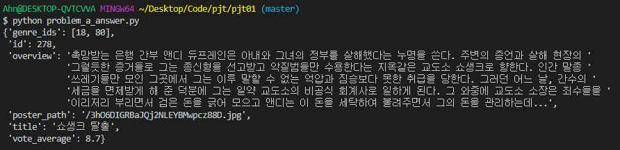
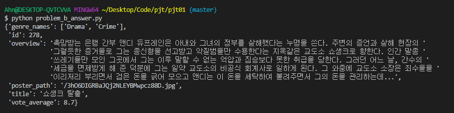
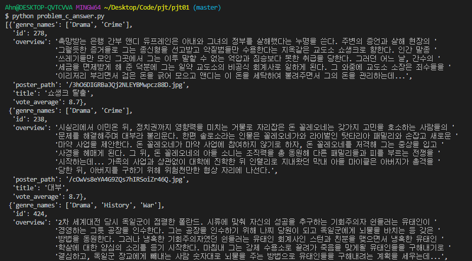
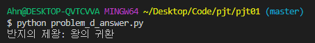
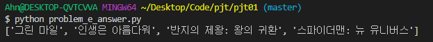

# 📗Python을 활용한 데이터 수집


### A. 제공되는 영화 데이터의 주요내용 수집

> 샘플 영화데이터가 주어집니다. 이중 서비스 구성에 필요한 정보만 뽑아 반환하는 함수를 완성합니다. 완성된 함수는 다음 문제의 기본기능으로 사용됩니다.

#### 🔑 생각한 방법 

- A번의 경우 딕셔너리 생성을 하면 끝나기 때문에 딕셔너리를 생성 후, 해당하는 키와 값을 넣었습니다.
- 반환할 리스트 이름 - `result`

#### 📰 실제 코드

```python
def movie_info(movie):
    # 여기에 코드를 작성합니다.    
    result = {'genre_ids': movie.get('genre_ids'), 'id': movie.get('id'),
    'overview': movie.get('overview'), 'poster_path': movie.get('poster_path'),
    'title': movie.get('title'), 'vote_average': movie.get('vote_average')
    }
    return result
```

#### 💡 느꼈던 점이나 어려웠던 부분, 추가사항

- A번은 딕셔너리 생성이 다였기 때문에 어렵진 않았습니다만, `result` 안에 모든 key만 지정하고 value는 반복문으로 했으면 `result`가 너무 길어지는 것을 방지 했을까 생각합니다. 
- 또 `commit`하고 보니 주석을 사용하지 않았던 점이 아쉽네요.`result`가 어떤 변수인지 간단히 적어두면 좋을 것 같습니다.

#### 📇 결과




### B. 제공되는 영화 데이터의 주요내용 수정

> 이전단계에서 만들었던 데이터 중 genre_ids를 genre_names로 바꿔 반환하는 함수를 완성합니다. 완성된 함수는 다음 문제의 기본기능으로 사용됩니다.

#### 🔑 생각한 방법 

1. 기본적인 A의 코드를 기반으로 `genre_ids`를 `genre_names`로 바꾸는 것인데, 저의 경우 기본적으로 A의 코드처럼 딕셔너리 생성(`result`)합니다. 다만 생성시 `genre_ids`를 `genre_names`로 하고 빈 리스트로 하여 만들었습니다. 

2. 해당 영화의 장르 코드를 가져옵니다(`genre_ids`)
3. 각 장르 코드(`for`)를 genres 리스트 파일에서 순회(`for`)하면서 같은 `id`를 발견할 경우(`if`), `result` 중 `genre_name`키에 value로써 삽입합니다. 장르는 여러가지 속성을 가지므로 리스트로 하여 `append`를 통해 해당 영화의 장르 코드가 존재하는 한 추가하도록 합니다.
4. 순회가 끝나면 `result`를 반환합니다.

#### 📰 실제 코드

```python
def movie_info(movie, genres):
    # 여기에 코드를 작성합니다.  
    # 전체 movie.json에서 기본으로 가져올 아이템들 가져오기
    result = {'genre_names': [], 'id': movie.get('id'),
    'overview': movie.get('overview'), 'poster_path': movie.get('poster_path'),
    'title': movie.get('title'), 'vote_average': movie.get('vote_average')
    }
    
    # 장르 코드를 가져오기
    gcode = movie.get('genre_ids')
    # print(gcode) # 확인용
    
    # 각 장르 코드 마다
    for code in gcode:
        # 해당 장르 코드 리스트를 순회하며 id가 같은지 확인 
        for genre in genres:
            # 같은 아이디를 찾음(해당 코드임) = result 장르탭에 삽입
            if code == genre.get('id'):
                # print(genre.get('name')) # 확인용
                result['genre_names'].append(genre.get('name'))
                break # 더 돌 필요가 없으므로 끝내기
    
    return result
```

#### 💡 느꼈던 점이나 어려웠던 부분, 추가사항

- 이번 프로젝트 중에서 가장 어렵다고 느꼈습니다. 처음 딕셔너리의 값을 가져와서 그것을 조건에 따라 순회하는 부분까지는 비교적 어렵지 않게 접근했습니다. 다만 딕셔너리 내에서 리스트의 형태로 집어넣는 부분에서 해당 값에서 어떻게 리스트 형태로 집어넣지?? 하는 부분에서 막혔습니다.
- 생각해보니 `result` 만들때 이미 빈리스트 형태니까 그냥 `append`로 해당하는 장르의 이름만 가져와서 넣으면 되는거아냐? 라고 생각했고 그대로 실행하니 무사히 해결되어서 다행이었습니다.
- 보면 볼수록 리스트, 딕셔너리가 섞여서 존재해 사람 머리 아프게 만들었습니다.. ㅠㅠ 좀 더 익숙해져서 필요에 따라 정확히 사용할 수 있을 정도로 실력을 키워야 할 것 같습니다.

#### 📇 결과




### C. 다중 데이터 분석 및 수정

> TMDB기준 평점이 높은 20개의 영화데이터가 주어집니다. 이 중 서비스 구성에 필요한 정보만 뽑아 반환하는 함수를 완성합니다. 완성된 함수는 향후 커뮤니티 서비스에서 제공되는 영화 목록을 제공하기 위한 기능으로 사용됩니다

#### 🔑 생각한 방법 

1. C는 B에서 생성한 영화 정보 데이터 양식을 토대로 모든 영화 데이터를 같은 형식으로 만들어 저장하는 것입니다. 그러므로 기본적인 로직은 B와 같습니다.

2. 추가되는 부분은 **제공 영화 데이터가 20개**이므로 전체를 리스트로 감싸고 안의 데이터를 딕셔너리로 받아야 하는 부분입니다.
3. 기존에 사용하던 `result` 를 리스트로 생성하고, 각 `movies`의 영화 정보를 순회하며 B의 과정을 거친뒤 가공된 데이터 `item` 을 `result` 리스트에 `append` 로 집어넣었습니다.

#### 📰 실제 코드

```python
def movie_info(movies, genres):
    # 여기에 코드를 작성합니다.  
    # 전체 movies 딕셔너리에서 각 요소별로 해당 하는 정보만 얻어와서 집어넣기
    result = [] # 딕셔너리를 넣을 리스트
    for movie in movies:
        # 전체 movie.json에서 기본으로 가져올 아이템들 가져오기
        item = {'genre_names': [], 'id': movie.get('id'),
        'overview': movie.get('overview'), 'poster_path': movie.get('poster_path'),
        'title': movie.get('title'), 'vote_average': movie.get('vote_average')
        } # 각 영화별 정보
        
        # 장르 코드를 가져오기
        gcode = movie.get('genre_ids')

        # 각 장르 코드 마다
        for code in gcode:
            # 해당 장르 코드 리스트를 순회하며 id가 같은지 확인 
            for genre in genres:
                # 같은 아이디를 찾음(해당 코드임) = result 장르탭에 삽입
                if code == genre.get('id'):                    
                    item['genre_names'].append(genre.get('name'))
                    break # 더 돌 필요가 없으므로 끝내기
        result.append(item)

    return result  
```

#### 💡 느꼈던 점이나 어려웠던 부분, 추가사항

- B번에서는 ` result` 딕셔너리에 `value` 가 리스트인 `genre_name` 이라는 곳에 데이터를 넣는 거였다면, 이번에는 `result` 라는 리스트에 영화 정보 딕셔너리인 `item` 을 집어 넣는 것이므로 B번의 코드를 반대로 생각해서 활용하면 쉽게 진행할 수 있다고 생각합니다. 

#### 📇 결과



**너무 길어져서 이하 생략합니다.**


### D. 알고리즘을 통한 데이터 출력

> 세부적인 영화 정보 중 수익 정보(revenue)를 이용하여 모든 영화 중 가장 높은 수익을 낸 영화를 출력하는 알고리즘을 작성합니다. 해당 데이터는 향후 커뮤니티 서비스에서 메인 페이지 기본정보로 사용됩니다.

#### 🔑 생각한 방법 

1. 이번에는 새롭게 `id` 에 맞춰서 파일을 읽고, 거기에서 `revenue` 정보를 가져온 뒤, 비교를 하며 가장 수익이 높은 영화를 찾아내고, 그 영화 제목을 반환합니다.
2. 먼저 각 `movie` 를 순회하며 값을 비교할 것이므로 `for` 문으로 시작합니다.
3. 먼저 `movie` 에서 `id` 키워드를 가져온 후, `open` 함수를 통해 `id.json`을 열어주고, 딕셔너리 형태로 파일 처리합니다. (`json.load`)
4. 이후에는 기존에 최대값 비교와 같은 알고리즘 형태로 진행합니다. 다만 최대값 변경시 영화 제목도 같이 변경합니다. `max_value < now value`
5. 모든 과정이 끝나면 수익이 가장 큰 영화 제목을 반환합니다. (`max_movie`)

#### 📰 실제 코드

```python
def max_revenue(movies):
    
    max_movie = '' # 수익 높은 영화 제목
    max_value = 0 # 수익 비교용
    # 모든 무비를 순회 하며 수익을 비교해야함
    for movie in movies:
        # 수익을 알아내기 위한 키워드는 파일 접근을 위해 알아낼 요소는 id
        movie_id = str(movie.get('id'))
        # 해당 id에 맞는 파일 읽기
        revenue_json = open('data/movies/'+movie_id+'.json', encoding='UTF8')
        revenue_list = json.load(revenue_json)
        
        # 비교 위한 값 생성
        now_value = int(revenue_list.get('revenue'))
        if max_value < now_value : # 수익이 더 클 경우 교체
            max_value = now_value
            max_movie = movie.get('title')
    
    return max_movie
```

#### 💡 느꼈던 점이나 어려웠던 부분, 추가사항

- 파일을 읽고 변환하는 과정은 오전에서 배웠기도 했고, 밑의 실제 실행 코드에도 적혀 있기 때문에 그것을 토대로 id 만 추가해줘서 간단히 만들 수 있었습니다.
- revenue의 경우 str인지 int인지 알 수 없어서 확실하게 `int()` 넣어 값 비교가 되게끔 가져왔습니다.

#### 📇 결과




### E. 알고리즘을 통한 데이터 출력

> 세부적인 영화 정보 중 개봉일 정보(release_date)를 이용하여 모든 영화 중 12월에 개봉한 영화들의 제목 리스트를 출력하는 알고리즘을 작성합니다. 해당 데이터는 향후 커뮤니티 서비스에서 추천기능의 정보로 사용됩니다.

#### 🔑 생각한 방법 

1. D의 코드에서 파일 접근 하는 부분 까지는 같고 이후에 개봉일자 부분을 가져온 뒤, 월에 해당하는 문자열을 슬라이싱합니다.
2. 해당 문자열을 `int()` 로 정수로 바꿔준 뒤, 12일 경우 해당 하는 영화의 제목을 `result` 리스트에 넣습니다.
3. 전체 과정이 끝나면 `result` 를 반환합니다.

#### 📰 실제 코드

```python
def dec_movies(movies):
    result = [] # 제목 리스트를 반환할 리스트

    # 모든 영화를 순회해야함
    for movie in movies:
        # 파일 접근을 위해 알아낼 요소는 id
        movie_id = str(movie.get('id'))
        # 해당 id에 맞는 파일 읽기
        movie_json = open('data/movies/'+movie_id+'.json', encoding='UTF8')
        movie_list = json.load(movie_json)

        # 개봉일자 정보 가져오기
        release_date = movie_list.get('release_date')
        # 문자열 슬라이싱 하기 - 월 부분만 
        release_date = release_date[5:7]
        

        # 해당 개봉 월이 12월 이면 영화 제목을 리스트에 넣기
        if int(release_date) == 12:
            # print(movie.get('title'), release_date) # 확인용
            result.append(movie.get('title'))
    
    return result
```

#### 💡 느꼈던 점이나 어려웠던 부분, 추가사항

- 저의 경우 슬라이싱으로 풀었지만, 저렇게 년-월-일로 정해져 있으면 파이썬 날짜 관련 함수를 가져와 월만 추출하는 방법으로 진행해도 괜찮을 것 같습니다.
- 또 split을 이용해서 `-` 기준으로 나누고 1번째 인자를 가져와서 진행해도 괜찮을 것 같습니다.

#### 📇 결과

