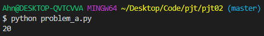
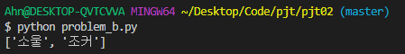
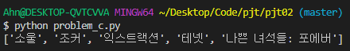
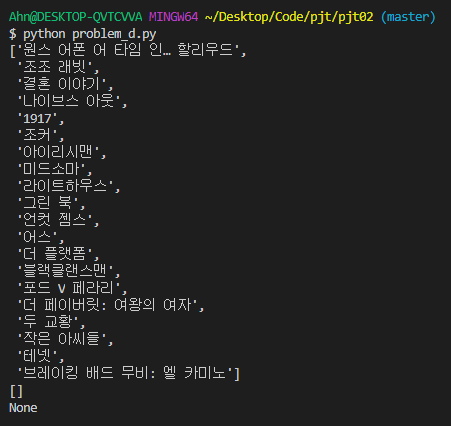
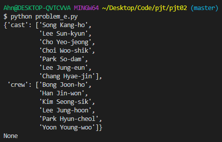

# Python을 활용한 데이터 수집 II - 안병진


## 프로젝트 목표

- Python 기본 문법 실습
- 데이터 구조에 대한 분석과 이해
- 요청과 응답에 대한 이해


## 개발 환경 및 사용 데이터

- 개발 언어 - Python 3.8.7
- 개발 환경 - Windows 10 64bit, vscode

- 사용 라이브러리 - requests, pprint, operator, tmdb(제공 받음)
- 사용 데이터 - TMDB API( https://developers.themoviedb.org/3 ), 영화 정보 API 서비스, 영화 검색 API 서비스


## 요구사항

> 커뮤니티 서비스 개발을 위한 데이터 수집 단계로, 전체 데이터 중 필요한 데이터를 크롤링 하는 과정을 진행합니다. 아래 기술된 사항은 필수적으로 구현해야 하는 내용입니다.


### A. 영화 개수 카운트 기능 구현

> 영화 개수를 출력합니다. 완성된 기능은 향후 커뮤니티 서비스에서 제공되는 기
> 능으로 사용됩니다.

#### 🙄 명세서를 읽고 든 생각

- 영화 개수를 출력하므로 for문으로 `count` 를 계산 할지, 아니면 리스트와 같은 자료형이면 `len` 을 통해 해당 자료 갯수를 출력하면 되겠구나 생각했습니다.
- 그리고 url의 경우 오전에 보여주신 클래스를 토대로, api 키 값을 넣고 url을 생성한 뒤, 영화 리스트를 받아오면 전체 갯수의 반환법은 위의 생각을 토대로 구상하면 되겠구나 생각했습니다.

#### 📋 작업 순서

1. tmdb의 `URLMaker` 클래스를 가져와 인스턴스를 생성합니다. `maker` 
2. `get_url` 메소드를 통해 영화 리스트를 가져올 url을 생성합니다. `url`  
3. `request.get` 을 통해 url을 통해 서버에 데이터를 요청하고 값을 받아 옵니다. `res` 
4. 가져온 데이터(`json` )를 파이썬 딕셔너리로 변환합니다. `popular_movies` 
5. 페이지를 보니 `results` 리스트에 각 영화 정보가 딕셔너리로 저장되어 있었습니다. 그래서 `results` 의 크기가 곧 영화 갯수를 의미함을 알 수 있었습니다.
6. 그러므로 `results` 의 크기를 반환합니다. `len(popular_movies['results'])` 

#### 📰 실제 코드

```python
def popular_count():
    # URLMaker 클래스를 통해 maker 인스턴스 생성
    maker = URLMaker('031b6156fbe52ee9595fddf7b81190fa')
    # url를 만들기 위해 get_url에 인자를 넣어 url 문자열 생성
    url = maker.get_url(region='KR', language='ko')
    # 해당 문자열을 토대로 requests.get을 통해 해당 url 페이지의 정보를 가져옴(res로)
    res = requests.get(url) 
    # 가져온 정보(json)를 딕셔너리로 변환
    popular_movies = res.json()

    # 해당 페이지를 본 결과, results에 리스트에 담겨있는 각 아이템들이 영화들에 대한 정보
    # 즉 results의 크기가 총 영화 갯수와 같음
    return len(popular_movies['results'])
```

#### 💡 느꼈던 점이나 어려웠던 부분, 추가사항

- A번은 기본적인 갯수 반환 이었으므로 크게 어렵다고 느낀 점은 없었습니다. 다만 해당 정보 페이지가 어떤 형태로 들어올지는 일단 열어봐야 하므로 `pprint` 등을 통해 데이터를 살펴봐야 합니다. 해당 url을 통해 본 결과에서는 대부분의 내용이 `results` 리스트에서 각각의 영화 정보를 딕셔너리로 관리하고 있다는 것을 파악해야 `len` 함수를 사용할 수 있을 것 같습니다. 그것이 아니라면 일반적인 for 문을 통해 count를 관리해야 할 것 같습니다.

#### 📇 결과




### B. 특정 조건에 맞는 영화 출력

> popular를 기준으로 가져온 영화 목록 중 평점이 8 이상인 영화 목록을 출력하는 기능을 완성합니다.

#### 🙄 명세서를 읽고 든 생각

- 보자마자 popular를 기준으로 영화를 가져 오므로 A번 문제에서 데이터 읽어오는 것 까지는 같겠구나 생각했습니다.
- 추가되는 부분은 평점이 8인 영화 목록 출력이므로 이것을 가공하는 과정을 추가해야 합니다.
- 모든 영화 정보 내에서 평점을 찾아야 하므로 for문을 써야하고, if 문을 통해 평점 8점일 경우 결과 리스트에 담고, 모든 작업이 끝나면 반환 하면 될 것이라 생각했습니다.

#### 📋 작업 순서

1. url을 통해 데이터를 받고, 파이썬 딕셔너리로 변환하는 과정은 A와 같습니다. `popular_movies` 
2. `results` 리스트에서 각 딕셔너리를 순회하므로 for문을 작성하고, 각 아이템마다 (`movie`) 
3. 해당 영화의 평점이 8점 이상이라면 `if movie['vote_average'] >= 8:` 
4. 반환할 결과 리스트에 값을 넣습니다. `result.append(movie['title'])` 
5. 모든 작업이 끝나면 결과 리스트를 반환합니다. `return result` 

#### 📰 실제 코드

```python
def vote_average_movies():
    # A 부분은 생략합니다.
    #----------------------------------------------------------
    
    # 페이지를 보니 평점은 results 딕셔너리 내부의 vote_average 라는 키를 통해 접근 할 수 있다.
    # 그리고 각 영화들 마다 평점을 확인 해야 하므로 for문을 통해 순회
    # 정리 하자면 results라는 영화정보가 담긴 딕셔너리를 데이터로 담고 있는 리스트에서 하나씩 순회
    # results(리스트) - 각 영화 정보(results의 아이템이면서 각각 딕셔너리로 구성)
    for movie in popular_movies['results']: 
        # 만약 해당 영화의 평점이 8점 이상이라면
        if movie['vote_average'] >= 8:
            # 해당 영화 제목(title)을 결과 리스트에 넣기
            result.append(movie['title'])

    # 모든 작업이 끝나면 결과 리스트를 반환
    return result
```

#### 💡 느꼈던 점이나 어려웠던 부분, 추가사항

- 명세서에 평점 부분이 vote_average라고 명시되어 있었고, 해당 데이터의 구조는 A번과 같은 구조이므로 for문과 if 문을 이용해 조건에 맞는 데이터만 처리해 주면 되는 심플한 문제였습니다.

#### 📇 결과




### C. 평점 순 정렬

> popular를 기준으로 가져온 영화 목록을 평점순으로 출력하는 함수를 완성합니다. 해당 기능은 향후 커뮤니티 서비스에서 기본으로 제공되는 영화 정보로 사용됩니다.

#### 🙄 명세서를 읽고 든 생각

- 당초 생각했던 것은 평점과 영화 제목만 리스트에 넣고, 그것을 정렬한뒤 5개까지 slicing 하여 결과를 반환하자 라고 생각했습니다.
- 구현 방법을 생각하던 도중 강사님이 sorted()의 itemgetter()를 이용한 정렬 방법을 알려주셔서 이것을 이용하여 풀어보자고 생각했습니다. - https://docs.python.org/ko/3/howto/sorting.html
- 정렬의 방법도 알았고 추출은 간단하니 바로 실행해보자 라고 생각했습니다.

#### 📋 작업 순서

1. 이번에도 popular를 기준으로한 영화 정보이므로 데이터를 가져오는 것은 A와 동일합니다. `popular_movies` 
2. 가져온 정보를 평점을 기준으로 하여 정렬합니다. 이번에는 강사님이 가르쳐주신 itemgetter()를 이용한sorted() 함수를 사용하였습니다. 다만 평점이 큰 순으로 정렬하므로 reverse를 통해 내림차순으로 정렬 기준을 바꿔줍니다. `sorted(popular_movies['results'], key=itemgetter('vote_average'), reverse=True)` 
3. sorted()는 정렬된 객체를 반환하므로 변수를 통해 받아줍니다. `vote_rank_list` 
4. 상위 5개만 뽑을 것이므로 `range(5)` 로 하여 상위 5개의 영화 제목을 결과 리스트에 담습니다. `result.append(vote_rank_list[i]['title'])` 
5. 작업이 종료되면 결과를 반환합니다. `return result` 

#### 📰 실제 코드

```python
def ranking():
	# A 부분은 생략합니다.
	#----------------------------------------------------------
    
    # itemgetter(평점)을 기준으로 ['results'] 안에 있는 데이터 들을 정렬합니다. 
    # 다만 정렬시 기본은 오름 차순이므로 내림 차순으로 변환해주면 리스트를 뽑아내기 편리합니다. 
    # 그러므로 reverse를 통해 정렬 순서를 뒤집습니다.
    vote_rank_list = sorted(popular_movies['results'], key=itemgetter('vote_average'), reverse=True)

    # 상위 5개의 리스트만 뽑아낼 것이므로 범위를 5로 하여 뽑기
    for i in range(5): 
        # 평점 1위 부터 5위 까지의 영화 제목을 결과 리스트에 담기
        result.append(vote_rank_list[i]['title'])

    # 모든 작업이 끝나면 결과 리스트를 반환
    return result
```

#### 💡 느꼈던 점이나 어려웠던 부분, 추가사항

- 당초 생각했던 대로 진행했더라도 어떻게 평점을 기준으로 정렬하지? 라고 생각하게 되서 구글링을 하게 될 것 같았습니다만, 강사님이 친절하게 어떻게 진행하면 될지 힌트를 주셔서 이를 기반으로 진행할 수 있었습니다. 
- 파이썬은 하면서 느끼지만 자료형을 편집하는데 있어 사용자가 편리한 여러 기능을 참 잘 갖추고 있구나하고 다시 한번 느꼈습니다.
- 처음에 변수에 담지 않고 그냥 sorted()를 진행 했는데 값이 왜 안바뀌지? 라고 생각해봤더니 sorted()는 변환된 객체를 반환하니 원본은 건드리지 않겠구나 생각해서 변수에 값을 담았습니다. 이번 문제로 sorted()랑 sort() 중 누가 객체를 변환하는지 잊지 않을것 같습니다.
- 그리고 정렬된 결과 값을 처음 봤을때 오름 차순으로 정렬 되어 있어서 이거 그럼 내림 차순으로 정렬하려면 어떻게 해야하지? 생각하면서 sorted() 안의 넣을 argument를 보니 reverse라는게 있어 이게 정렬순서를 뒤집는건가? 생각해서 실행해보니 예상대로 내림 차순으로 바뀌어서 역시 argument도 이해하기 쉽게 적어야 사용자가 바로 알아듣고 사용할 수 있겠구나 생각했습니다.

#### 📇 결과




### D. 제목 검색, 영화 추천

> 해당영화를 기준으로 추천영화 목록을 출력하는 함수를 완성합니다. 해당 기능은 향후 커뮤니티 서비스에서 추천영화 기능으로 사용됩니다.

#### 🙄 명세서를 읽고 든 생각

- 처음에 읽었을 때 추천 영화가 어디에 있지? 였습니다. 어디에 있는 추천 영화 리스트라는 거지? 영화 검색하면 밑에 나오는 추천영화 목록인가? 해서 영화 이름을 검색해서 들어가보고 했습니다.
- 그러다가 api 쪽을 찾아보니 recommendation 탭이 있어서 혹시 여긴가 하고 봤더니 샘플 데이터를 보니 맞는 것 같았습니다. 마침 강사님도 같은 탭을 올려주셔서 아 이걸로 구현하는게 맞구나 생각해서 여기 적힌 api 작성법을 토대로 url를 생성했습니다. - https://developers.themoviedb.org/3/movies/get-movie-recommendations
- id를 받아오는 부분은 오전에 수업했던 tmdb에서 title_id 메소드로 구현 되어 있으니 그대로 사용 하면 될 것이라 생각했고, 마찬가지로 여기서 맞지 않는 영화제목을 가져오면 None을 반환한다고 했으니 이것을 이용하면 id가 None일 경우 그대로 None을 출력하도록 하면 되겠구나 생각했습니다.
- url을 통해 가져온 정보 리스트를 받아 영화 제목을 처리하는 것은 B에서도 다루어 봤으니 어렵지 않을 것이라 생각했습니다.

#### 📋 작업 순서

1. 먼저 URLMaker의 메소드인 movie_id에 title인자를 넘겨주고 실행시켜 movie_id 값을 가져옵니다. `title_id` 
2. 혹시 `title_id` 값이 None이라면 검색 결과에 맞는 영화 제목이 없다는 것이므로 마찬가지로 None을 결과로 반환합니다. `return None`
3. `title_id` 에 값이 있다면 recommend api 작성 양식에 맞추어 url을 생성합니다. `recommend_url` 
4. url을 토대로 데이터를 가져오고 각 영화 정보를 읽으며(for문) 그 중에서 영화 제목인 `title` 의 값을 가져와 결과 리스트에 넣습니다. `result.append(movie['title'])` 
5. 혹시 값이 없으면 for문 자체가 실행 되지 않으므로 초기 값인 `result = []` 상태로 result가 반환될 것입니다.
6. 모든 작업 종료 후 결과 리스트를 반환합니다. `return result` 

#### 📰 실제 코드

```python
   # 결과값을 담을 result 리스트
    result = []
    # URLMaker 클래스를 통해 maker 인스턴스 생성
    maker = URLMaker('031b6156fbe52ee9595fddf7b81190fa')
    # 영화 제목을 토대로 movie_id 메소드를 사용하여 해당 영화의 id를 찾아 내기
    title_id = maker.movie_id(title)
    # 올바르지 않은 영화 제목을 검색할 경우 title_id에 None이 반환되므로 
    # title_id = None이라는 뜻은 잘못된 영화 제목 검색으로 인해 id가 없을 때
    if title_id == None:
        # 3번 조건 - id 가 없을 때 None 반환
        return None

    # 여기서 부터는 id를 찾아 냈을 때의 경우
    # url를 만들기 위해 get_url에 인자를 넣어 url 문자열 생성하려고 했으나, 양식이 미묘하게 다르므로 별도 생성
    recommend_url = f'https://api.themoviedb.org/3/movie/{title_id}/recommendations?api_key=031b6156fbe52ee9595fddf7b81190fa&language=ko'
    # 해당 문자열을 토대로 requests.get을 통해 해당 url 페이지의 정보를 가져옴(res로)
    res = requests.get(recommend_url) 
    # 가져온 정보(json)를 딕셔너리로 변환
    recommend_movies = res.json()
    # 해당 영화 정보들을 순회(위치는 results)하며 영화 제목을 리스트에 넣기
    # 4번 조건 - 추천 영화가 없으면 result는 빈 리스트이므로 빈 리스트 그대로 반환 될 것(순회를 안하므로)
    for movie in recommend_movies['results']:
        result.append(movie['title'])
    # 모든 작업 종료 후 결과 리스트 반환
    return result

```

#### 💡 느꼈던 점이나 어려웠던 부분, 추가사항

- title_id로 id 값을 가져오는 것까지는 별 문제 없었습니다만 url 생성시 get_url을 사용하려고 하니 recommend의 경우 category와 feature 사이에 영화 id를 적어야 했습니다. 그래서 get_url를 사용하지 못하고 수동으로 생성해야 했습니다. 적으면서 혹시나 오타날까 걱정했고, 역시나 ?를 적지않아서 오류가 발생했었습니다.
- 그 외에 데이터를 받아 처리하는 과정은 기존에 했던 과정과 같았기 때문에 크게 어려운 점은 없었습니다.

#### 📇 결과




### E. 배우, 감독 리스트 출력

> 영화에 출연한 배우들과 감독의 정보가 저장된 딕셔너리를 출력하는 함수를 완성합니다. 해당 기능은 향후 커뮤니티 서비스에서 기본으로 제공되는 영화 정보로 사용됩니다.

#### 🙄 명세서를 읽고 든 생각

- 앞부분에 영화의 id 가져오는 부분은 필요하겠구나 생각했고, D에서 다루었던 코드를 가져오면 되겠구나 생각했습니다.
- 앞서는 recommendation이었다면 이번에는 credit api를 이용해야 했습니다. 그리고 여기의 작성 양식을 보니 get_url을 사용할 수 없을 것 같았습니다.
- 그래서 이렇게 중간에 id가 들어가는 경우가 나중에도 있을지 모르니 메소드를 아예 만들자 생각했고 기존의 get_url을 응용한 get_plusid_url을 만들었습니다.
- 이후에 조건에 맞게 데이터를 처리하는 과정은 이전까지와 크게 다르지 않습니다.

#### 📋 작업 순서

1. id를 찾아오는 부분까지는 D와 같습니다.
2. E번 부터는 get_plusid_url 메소드로 id가 추가된 url를 생성합니다.  `credit_url` 
3. 이후에는 조건에 맡게 각각 리스트에 넣어줍니다. `cast` `crew` 
4. 그리고 두 리스트의 이름을 키 값으로 하여 결과 딕셔너리에 넣어줍니다. `result` 
5. 모든 리스트가 들어간 결과 딕셔너리를 반환합니다. `return result` 

#### 📰 실제 코드

```python
# URLMaker에 중간에 영화 id가 들어가는 api 사용시 만들 url 생성 함수를 만들었습니다. 
def get_plusid_url(self, mv_id, category='movie', feature='popular', **kwargs):
        url = f'{self.url}/{category}/{mv_id}/{feature}'
        url += f'?api_key={self.key}'

        for k, v in kwargs.items():
            url += f'&{k}={v}'

        return url
```


```python
def credits(title):
	# D번과 유사한 부분 생략합니다(id 찾고 None일경우 None 리턴)
    # -----------------------------------------------------------------

    # E번 부터는 아예 클래스에서 movie_id가 들어간 url을 만드는 메소드를 만들어서 사용함
    credit_url = maker.get_plusid_url(title_id, feature='credits', language='ko')
    print(credit_url)
    # 해당 문자열을 토대로 requests.get을 통해 해당 url 페이지의 정보를 가져옴(res로)
    res = requests.get(credit_url) 
    # 가져온 정보(json)를 딕셔너리로 변환
    credit_list = res.json()
    
    for credit in credit_list['cast']:
        # 배우 이면서 cast_id가 10보다 작은 경우
        if credit['known_for_department'] == 'Acting' and credit['cast_id'] < 10:
            # 배우 리스트에 넣기
            cast.append(credit['name'])
    
    for credit in credit_list['crew']:
        # 영화 감독인 경우
        if credit['department'] == 'Directing':
            # 감독 리스트에 넣기
            crew.append(credit['name'])

    
    # 모든 작업이 끝나면 배우, 감독 리스트를 result 딕셔너리에 넣기
    result['cast'] = cast
    result['crew'] = crew

    # 모든 리스트가 들어간 result 딕셔너리를 반환
    return result
```

#### 💡 느꼈던 점이나 어려웠던 부분, 추가사항

- D번과 같이 get_url을 사용할 수 없어서 추후에 중간에 id가 들어간 api를 사용하기 위한 메소드를 아예 만드는게 낫다고 생각했습니다. 그래서 중간에 get_url에서 mv_id를 추가한 메소드를 생성했습니다.
- 진작에 다 맞는 결과라고 생각했는데 끝나기전에 실행해보니 결과 값이 달라 진땀 냈습니다; 알고보니 데이터에 cast와 crew가 따로 리스트로 존재하는 것을 알게되어 황급히 코드를 수정했습니다. 앞으로는 출력 결과를 자세히 살펴서 이상 없는지 다시 한번 확인해야 겠습니다. 

#### 📇 결과

