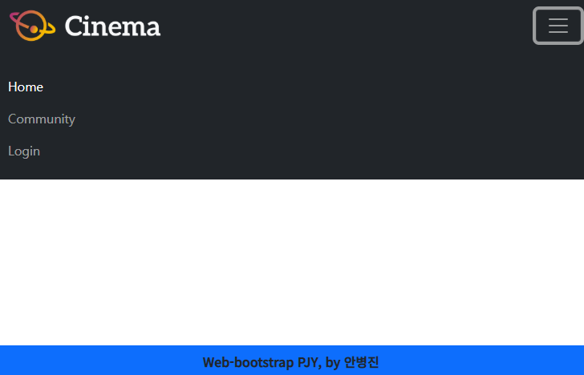
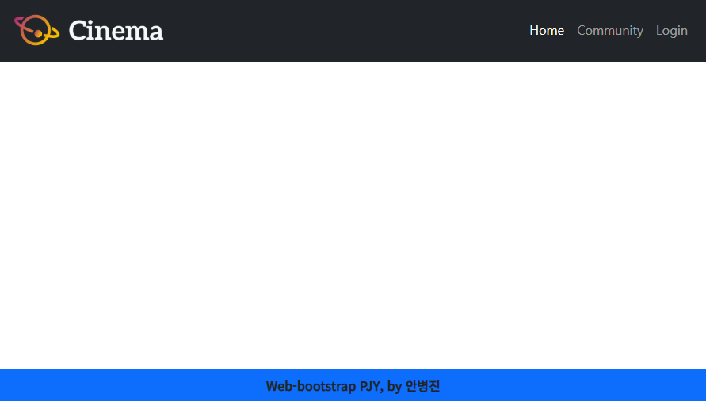
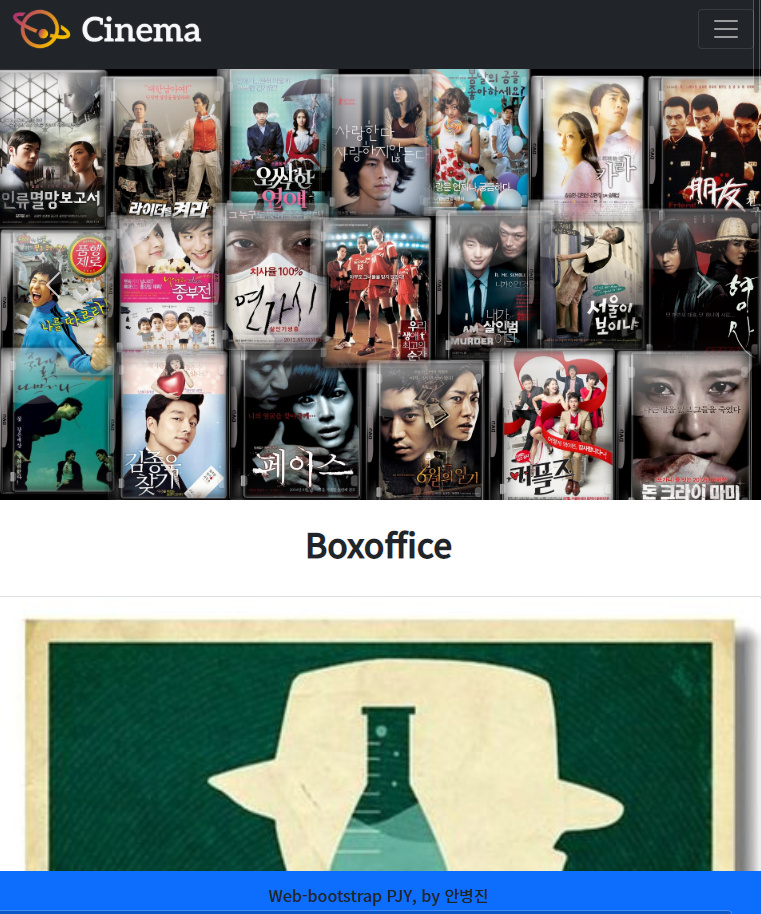
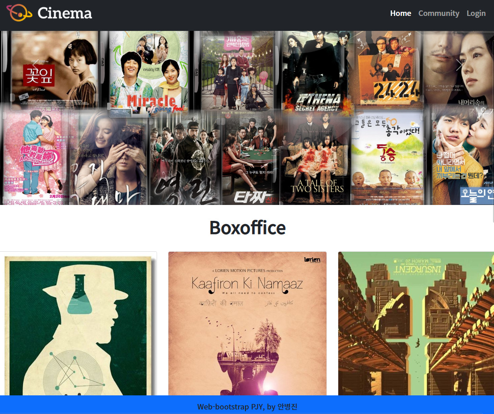
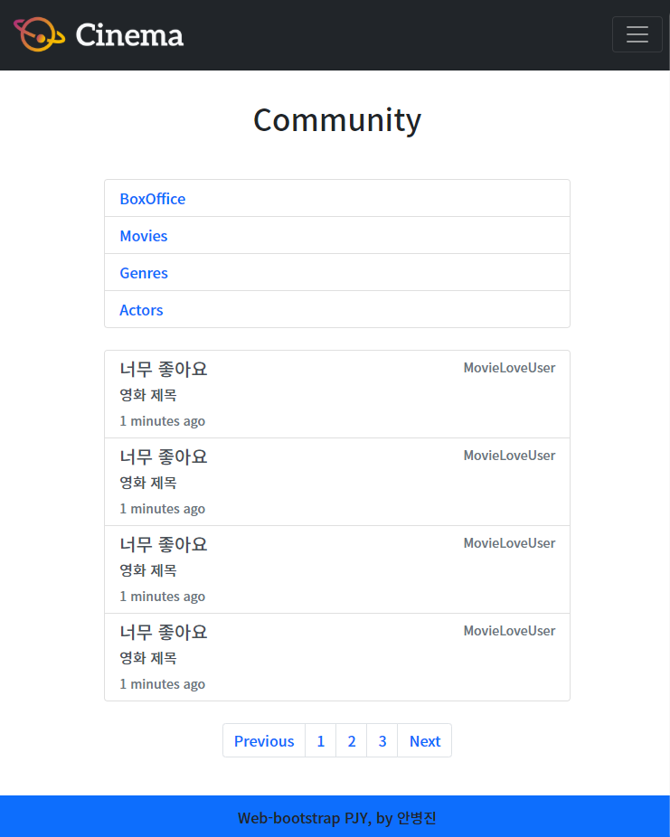
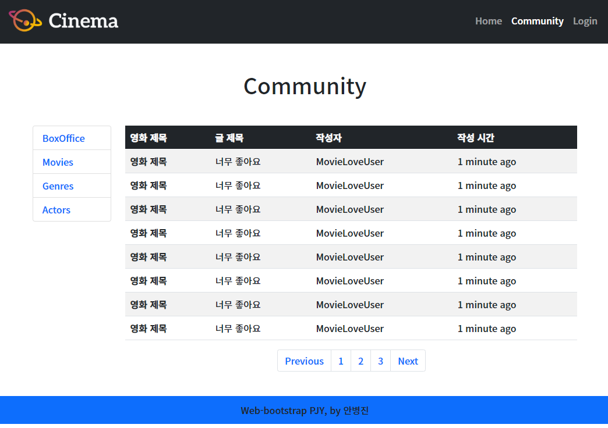

# 반응형 웹 페이지 구성 - 안병진


## 프로젝트 목표

- HTML을 통한 웹 페이지 마크업 분석
- CSS 라이브러리의 이해와 활용
- 컴포넌트 및 그리스 시스템 활용
- 커뮤니티 서비스 반응형 레이아웃 구성


## 개발 환경 및 사용 데이터

- 개발 언어 - HTML, CSS
- 개발 환경 - Windows 10 64bit, VSCode, Google Chrome Browser
- 사용 라이브러리 - Bootstrap v5.0


## 요구사항

> 커뮤니티 서비스 개발을 위한 화면 구성 단계로, 유저가 보는 프론트엔드를 개발합니다. 아래 기술된 사항은 필수적으로 구현해야 하는 내용입니다.


### A. 01_nav_footer

> 네비게이션 바(Navigation Bar), 푸터(Footer)

#### 🙄 명세서를 읽고 든 생각

- 네이게이션 바는 기존에 navbar 컴포넌트를 이용해 구성해본 경험이 있기에 거기에서 필요 사양에 맞게 바꾸면 된다고 생각합니다.
- 푸터도 기존에 배웠던 방법대로 진행하고, 밑에 고정되는 부분만 잘 처리하면 될 것 같습니다.

#### 📋 작업 순서

1. 먼저 부트스트랩 컴포넌트탭의 navbar에서  navbar를 가져옵니다. (navbar - supported-content)
2. 명세에 맞게 코드를 구성합니다.(top 고정, 로고 이미지 삽입 등등)
3. modal 또한 필요하기에 modal 컴포넌트에서 적절한 부분을 가져옵니다. (modal - static-backdrop)
4. modal 내에서는 form이 필요한데 form 탭에서 가져옵니다. (form - overview)
5. 해당 명세에 맞게 코드를 수정합니다.
6. footer의 경우 중앙 정렬을 위해 flex 및 text-center를 이용합니다.
7. 그리고 하단 정렬을 위해 fixed-bottom 속성을 넣습니다.
8. 글씨 부분의 기본 폰트가 마음에 들지 않아 noto sans kr로 바꿨습니다. (style="font-family: 'Noto Sans KR', sans-serif;)

#### 📰 실제 코드

```html
  <!-- https://getbootstrap.com/docs/5.0/components/navbar/#supported-content -->
  <!-- navbar 클래스 활용, md 이상일때 전체모드(큰모드, 11), 기본글씨색 등 테마 다크, 뒷배경 다크, flex 디스플레이, top 고정(1) -->
  <nav class="navbar navbar-expand-md navbar-dark bg-dark d-flex sticky-top p-0">
    <!-- 여기 패딩으로 인해 토글 사용시 흰공간 생성됨, 패딩을 0으로 주기 -->
    <div class="container-fluid p-0">
      <!-- 제목 부분, 로고 이미지 삽입(2), 클릭시 home.html로 연결(3) padding 0으로 마진으로 조금떼기 -->
      <a class="navbar-brand p-0 ms-2" href="./02_home.html"></a>
      <!-- 햄버거 버튼 생성 마진으로 간격 만들기 me2 -->
      <button class="navbar-toggler me-2" type="button" data-bs-toggle="collapse" data-bs-target="#navbarSupportedContent" aria-controls="navbarSupportedContent" aria-expanded="false" aria-label="Toggle navigation">
        <span class="navbar-toggler-icon"></span>
      </button>
      <div class="collapse navbar-collapse" id="navbarSupportedContent">
        <!-- ul, li 클래스 사용(4)  마진 왼쪽 오토로 우측배치(flex 사용시 toggle과 겹치므로 못씀 5), 각 링크 마다 클릭할 때 해당 페이지로 이동(6) -->
        <ul class="navbar-nav ms-auto bg-dark p-3">
          <li class="nav-item">
            <!-- home 강조 active(7) -->
            <a class="nav-link active " aria-current="page" href="./02_home.html">Home</a>
          </li>
          <li class="nav-item">
            <a class="nav-link" href="./03_community.html">Community</a>
          </li>
          <li class="nav-item">
            <!-- 클릭시 Login modal 컴포넌트 호출(8) toggle-modal(모달 타입 호출) target-해당하는 모달 id -->
            <a class="nav-link" href="#" data-bs-toggle="modal" data-bs-target="#staticBackdrop">Login</a>
          </li>
        </ul>
      </div>
    </div>
  </nav>

<div>
    <!-- Modal -->
    <!-- https://getbootstrap.com/docs/5.0/components/modal/#static-backdrop -->
    <div class="modal fade" id="staticBackdrop" data-bs-backdrop="static" data-bs-keyboard="false" tabindex="-1" aria-labelledby="staticBackdropLabel" aria-hidden="true">
      <div class="modal-dialog">
        <div class="modal-content">
          <!-- modal 제목부분 -->
          <div class="modal-header">
            <h5 class="modal-title" id="staticBackdropLabel">Login</h5>
            <button type="button" class="btn-close" data-bs-dismiss="modal" aria-label="Close"></button>
          </div>
          <div class="modal-body">
            <!-- 바디 부분에 form 생성(9) -->
            <!-- https://getbootstrap.com/docs/5.0/forms/overview/#overview -->
            <!-- https://getbootstrap.com/docs/5.0/components/modal/#varying-modal-content -->
            <form>
              <!-- id 입력부 -->
              <div class="mb-3">
                <label for="InputEmail" class="form-label">Username</label>
                <input type="email" class="form-control" id="InputEmail" aria-describedby="emailHelp" placeholder="000@naver.com">
                <div id="emailHelp" class="form-text">Write your Username or Email</div>
              </div>
              <!-- password 입력부 -->
              <div class="mb-3">
                <label for="InputPassword" class="form-label">Password</label>
                <!-- form 내부 비밀번호는 표시 X(타입 패스워드 10) -->
                <input type="password" class="form-control" id="InputPassword">
              </div>
              <!-- checkbox -->
              <div class=" form-check">
                <input type="checkbox" class="form-check-input" id="exampleCheck1">
                <label class="form-check-label" for="exampleCheck1">Check me out</label>
              </div>
            </form>
          </div>
          <!-- 제출 및 닫는 부분 -->
          <div class="modal-footer">
            <button type="button" class="btn btn-secondary" data-bs-dismiss="modal">Close</button>
            <button type="submit" class="btn btn-primary">Submit</button>
          </div>
        </div>
      </div>
    </div>
  </div>

  <!-- 가운데 정렬, 하단고정 -->
  <footer class="bg-primary fixed-bottom d-flex text-center justify-content-center">
    <!-- noto sans 로 폰트 변경, 굵게 마진0 패딩2 -->
    <p class="fw-bold p-2 m-0" style="font-family: 'Noto Sans KR', sans-serif;">Web-bootstrap PJY, by 안병진</p>
  </footer>
```

#### 💡 느꼈던 점이나 어려웠던 부분, 추가사항

- 마지막 토글러 사용시 양 끝에 흰공간이 있었는데, 알고보니 컨테이너 자체에서 패딩이 걸려있어서 공간이 띄어졌기 때문이었습니다. 그래서 컨테이너의 패딩은 없애고 자체 요소들에게 패딩을 부여해서 양끝에서 조금씩 뗐지만 배경은 다 칠해진 상태를 구현했습니다.
- navbar에서 우측으로 정렬을 할 때 전에 비슷하게 구현할때 flex를 통해 정렬을 하니 toggle도 flex를 사용하는 터라 두개가 충돌해서 제대로 작동하지 않았습니다. 그래서 오늘 수업시간에 정렬 하는 방법이 3가지 있었다는 정리를 들으면서 마진을 이용해보면 되지 않을까 생각했고, 그것이 잘 적용되어서 잘 마무리 할 수 있었던 것 같습니다.

#### 📇 결과

768px 미만



768px 이상




### B. 02_home

> 01_nav_footer를 완성했다면, 네비게이션 바와 푸터를 복사하여 사용합니다.
>
> 네비게이션 바(Navigation Bar), Header, Section

#### 🙄 명세서를 읽고 든 생각

- 헤더에서는 3가지 이미지가 옆으로 돌아가며 보여주므로 carousel을 사용해야 할 것 같다고 생각했습니다. 또 시간을 사용하므로 시간 관련된 예제가 있는 컴포넌트를 사용해야겠다고 생각했습니다.
- 섹션에는 각 요소가 카드처럼 되어있고 크기마다 나열되는 갯수가 바뀌므로 그리드 시스템을 사용해 내용을 담고 있다고 생각했습니다. 즉 전체 레이아웃은 그리드이고 내부의 요소는 카드 컴포넌트 형태로 만들어져 있는것 같았습니다.

#### 📋 작업 순서

1. 먼저 헤더 작업하기 위해 부트스트랩 컴포넌트에서 carousel을 가져왔습니다. 시간을 관련된 기능까지 소개하는 탭에서 가져왔습니다. (carousel - individual-carousel-item-interval)
2. 명세에 맞게 이미지를 추가하고 적절한 인터벌(바뀌는 시간)을 두고 바뀌도록 수정했습니다.
3. 다음으로 section을 들어가며 먼저 그리드 row를 호출하여 그리드를 사용할 것임을 명시합니다. 그리고 576px 미만 일땐 컨텐츠가 하나씩, 그 이상일땐 3개씩 보여주도록 속성을 넣어줍니다. 또 컨텐츠간 간격유지를 위해 gutter를 넣습니다.
4. 각 카드 요소는 card 컴포넌트에 양식을 가져와 적절히 수정합니다. (card - grid-cards)

#### 📰 실제 코드

```html
  <!-- 02_home.html -->
  <header>
    <!-- carousel 사용 header 3장 이미지 자유-->
    <!-- https://getbootstrap.com/docs/5.0/components/carousel/#individual-carousel-item-interval -->
    <div id="movieListCarousel" class="carousel slide" data-bs-ride="carousel">
      <div class="carousel-inner">
        <!-- interval 자동전환 -->
        <div class="carousel-item active" data-bs-interval="5000">
          
        </div>
        <div class="carousel-item" data-bs-interval="5000">
          
        </div>
        <div class="carousel-item" data-bs-interval="5000">
          
        </div>
      </div>
      <a class="carousel-control-prev" href="#movieListCarousel" role="button" data-bs-slide="prev">
        <span class="carousel-control-prev-icon" aria-hidden="true"></span>
        <span class="visually-hidden">Previous</span>
      </a>
      <a class="carousel-control-next" href="#movieListCarousel" role="button" data-bs-slide="next">
        <span class="carousel-control-next-icon" aria-hidden="true"></span>
        <span class="visually-hidden">Next</span>
      </a>
    </div>
  </header>

  <h1 class="text-center fw-bold p-4">Boxoffice</h1>

  <!-- section -->
  <!-- grid cards -->
  <!-- https://getbootstrap.com/docs/5.0/components/card/#grid-cards -->
  <!-- 그리드 위한 row 생성, 간격 4(gutter) 기본 작을때 1개 배치, md 크기 이상 3개씩 배치 -->
  <section class="row g-4 row-cols-1 row-cols-md-3">
    <!-- col, card 같이하면 간격 gutter가 제대로 작용을 안함 -->
    <article class="col">
      <div class="card">
        
        <div class="card-body">
          <h5 class="card-title">Breaking Bad</h5>
          <p class="card-text">영화 내용 소개</p>
        </div>
      </div>     
    </article>
    <article class="col">
      <div class="card">
        
        <div class="card-body">
          <h5 class="card-title">We all need confess</h5>
          <p class="card-text">영화 내용 소개</p>
        </div>
      </div>
    </article>
    <article class="col">
      <div class="card">
        
        <div class="card-body">
          <h5 class="card-title">Insurgent</h5>
          <p class="card-text">영화 내용 소개</p>
        </div>
      </div>
    </article>
    <article class="col">
      <div class="card">
        
        <div class="card-body">
          <h5 class="card-title">Fight club</h5>
          <p class="card-text">영화 내용 소개</p>
        </div>
      </div>
    </article>
    <article class="col">
      <div class="card">
        
        <div class="card-body">
          <h5 class="card-title">Leon</h5>
          <p class="card-text">영화 내용 소개</p>
        </div>
      </div>
    </article>
    <article class="col">
      <div class="card">
        
        <div class="card-body">
          <h5 class="card-title">Joker</h5>
          <p class="card-text">영화 내용 소개</p>
        </div>
      </div>
    </article>
  </section>
```

#### 💡 느꼈던 점이나 어려웠던 부분, 추가사항

- 처음 영화 목록 배치를 카드로 배치할 때 col하고 card를 같은 article 태그안에 넣었는데, 카드도 생성되고 그리드대로 나뉘었지만, gutter가 작동되지 않아 서로 너무 붙어있었습니다. 그래서 각각 분리해서 태그를 작성하니 원하는대로 생성할 수 있었습니다. 컴포넌트간에 겹치는 일이 없도록 클래스 사용시 주의해야 할 것 같습니다.
- 1번에서 footer를 사용할때와 다르게 컨텐츠가 추가되니 fixed-bottom으로는 맨 밑의 내용을 먹어버리는 문제가 발생했습니다. 그래서 sticky를 사용하여 고정하도록 바꿨습니다.

#### 📇 결과

576px 미만



576px 이상




### C. 03_community

> 01_nav_footer를 완성했다면, 네비게이션 바와 푸터를 복사하여 사용합니다.
>
> 네비게이션 바(Navigation Bar), 게시판 목록, 게시판

#### 🙄 명세서를 읽고 든 생각

- 먼저 리스트 탭의 경우 list group을 사용하면 가볍게 풀수 있을거라 생각했습니다.
- 그리고 특정 사이즈에 따라 테이블과, 아티클로 나누어야 하는 부분이 꽤 까다롭겠다고 생각했습니다.
- 페이지 부분은 기존에 배운 부분과 크게 다르지 않다고 생각했습니다.

#### 📋 작업 순서

1. 전체를 그리드로 두고 크기가 클땐 list와 table, 크기가 작을땐 list와 article이 보이도록 설정합니다.
2. sidebar에 사용하기 위해 리스트 그룹 탭에서 해당 하는 코드를 가져와 수정합니다. (list-group - basic-example)
3. 게시판에서 테이블 부분은 테이블 탭에 맞춰서 양식에 맞게 작성합니다. (table - overview)
4. 아티클 부분은 리스트 처럼 나열하니 리스트 그룹에서 가져와 적절히 수정해서 넣습니다. (list-group - custom-content )
5. 페이징부분 또한 컴포넌트에서 가져와서 게시판, 아티클 부분에 맞게 가운데 정렬을 해줍니다.

#### 📰 실제 코드

```html
<!-- 03_community.html -->
  <!-- 전체의 컨테이너로 만들기 그리드 사용을 위해 -->
  <div class="main container">
    <h1 class="text-center m-5">Community</h1>

    <!-- 전체를 div로 감싸 row 그리드를 사용하기 위해 생성 -->
    <div class="row">
      <!-- sidebar와 board를 그리드로 배치 -->
      <!-- Sidebar -->
      <!-- https://getbootstrap.com/docs/5.0/components/list-group/#basic-example -->
      <aside class="col-12 col-lg-2">
        <ul class="list-group">
          <li class="list-group-item"><a href="#">BoxOffice</a></li>
          <li class="list-group-item"><a href="#">Movies</a></li>
          <li class="list-group-item"><a href="#">Genres</a></li>
          <li class="list-group-item"><a href="#">Actors</a></li>
        </ul>
      </aside>

      <!-- Board -->
      <!-- table과 article을 하나의 col로 두고 조건에 맞춰 크기 설정 -->
      <section class="col col-lg-10">
        <!-- 기본적으로 안보이다가 lg 사이즈 이상이 될시 보이도록 -->
        <div class="d-none d-lg-block">
            <!-- table -->
          <!-- https://getbootstrap.com/docs/5.0/content/tables/ -->
          <!-- 각 테이블이 1줄씩 색칠 왔다갔다 -->
          <table class="table table-striped">
            <!-- 제목 탭만 어둡게 -->
            <thead class="table-dark">
              <th scope="col">영화 제목</th>
              <th scope="col">글 제목</th>
              <th scope="col">작성자</th>
              <th scope="col">작성 시간</th>
            </thead>
            <tbody>
              <tr>
                <th scope="row">영화 제목</th>
                <td>너무 좋아요</td>
                <td>MovieLoveUser</td>
                <td>1 minute ago</td>
              </tr>
              <tr>
                <th scope="row">영화 제목</th>
                <td>너무 좋아요</td>
                <td>MovieLoveUser</td>
                <td>1 minute ago</td>
              </tr>
              <tr>
                <th scope="row">영화 제목</th>
                <td>너무 좋아요</td>
                <td>MovieLoveUser</td>
                <td>1 minute ago</td>
              </tr>
              <tr>
                <th scope="row">영화 제목</th>
                <td>너무 좋아요</td>
                <td>MovieLoveUser</td>
                <td>1 minute ago</td>
              </tr>
              <tr>
                <th scope="row">영화 제목</th>
                <td>너무 좋아요</td>
                <td>MovieLoveUser</td>
                <td>1 minute ago</td>
              </tr>
              <tr>
                <th scope="row">영화 제목</th>
                <td>너무 좋아요</td>
                <td>MovieLoveUser</td>
                <td>1 minute ago</td>
              </tr>
              <tr>
                <th scope="row">영화 제목</th>
                <td>너무 좋아요</td>
                <td>MovieLoveUser</td>
                <td>1 minute ago</td>
              </tr>
              <tr>
                <th scope="row">영화 제목</th>
                <td>너무 좋아요</td>
                <td>MovieLoveUser</td>
                <td>1 minute ago</td>
              </tr>
            </tbody>
          </table>
        </div>

        <!-- lg사이즈 미만을 보여주고 그 이상은 none으로 보여주지 않게, 패딩 위아래로 4를 주어 간격 주기 -->
        <div class="d-block d-lg-none py-4">
          <article>
            <!-- custom list group -->
            <!-- https://getbootstrap.com/docs/5.0/components/list-group/#custom-content -->
            <div class="list-group">
              <a href="#" class="list-group-item list-group-item-action">
                <div class="d-flex w-100 justify-content-between">
                  <h5 class="mb-1">너무 좋아요</h5>
                  <small class="text-muted">MovieLoveUser</small>
                </div>
                <p class="mb-1">영화 제목</p>
                <small class="text-muted">1 minutes ago</small>
              </a>
              <a href="#" class="list-group-item list-group-item-action">
                <div class="d-flex w-100 justify-content-between">
                  <h5 class="mb-1">너무 좋아요</h5>
                  <small class="text-muted">MovieLoveUser</small>
                </div>
                <p class="mb-1">영화 제목</p>
                <small class="text-muted">1 minutes ago</small>
              </a>
              <a href="#" class="list-group-item list-group-item-action">
                <div class="d-flex w-100 justify-content-between">
                  <h5 class="mb-1">너무 좋아요</h5>
                  <small class="text-muted">MovieLoveUser</small>
                </div>
                <p class="mb-1">영화 제목</p>
                <small class="text-muted">1 minutes ago</small>
              </a>
              <a href="#" class="list-group-item list-group-item-action">
                <div class="d-flex w-100 justify-content-between">
                  <h5 class="mb-1">너무 좋아요</h5>
                  <small class="text-muted">MovieLoveUser</small>
                </div>
                <p class="mb-1">영화 제목</p>
                <small class="text-muted">1 minutes ago</small>
              </a>
            </div>
          </article>
        </div>

        <!-- pagination -->
        <!-- https://getbootstrap.com/docs/5.0/components/pagination/#overview -->
        <nav aria-label="Page navigation example">
          <!-- 항상 가운데 유지 -->
          <ul class="pagination d-flex justify-content-center">
            <li class="page-item"><a class="page-link" href="#">Previous</a></li>
            <li class="page-item"><a class="page-link" href="#">1</a></li>
            <li class="page-item"><a class="page-link" href="#">2</a></li>
            <li class="page-item"><a class="page-link" href="#">3</a></li>
            <li class="page-item"><a class="page-link" href="#">Next</a></li>
          </ul>
        </nav>
      </section>
    </div>
    
  </div>
```

#### 💡 느꼈던 점이나 어려웠던 부분, 추가사항

- 처음에 특정 크기일때 보이고 그게 아닐땐 안보이게 하는법을 어떻게 할지 고민했습니다만 article과 table 두개로 나눠놓은 이유가 있다고 생각하고 찾아보니 display none이 있어 이것을 이용하면 풀 수 있겠구나 싶어서 시행했고, 생각대로 풀려 다행이었습니다.
- 오늘은 시간이 너무 빠듯해서 6시내에 README까지 작성을 못해 아쉬웠습니다. 좀 더 빠르게 프로젝트를 완성할 수 있도록 숙련도를 올려야 할 것 같습니다.

#### 📇 결과

992px 미만




992px 이상

