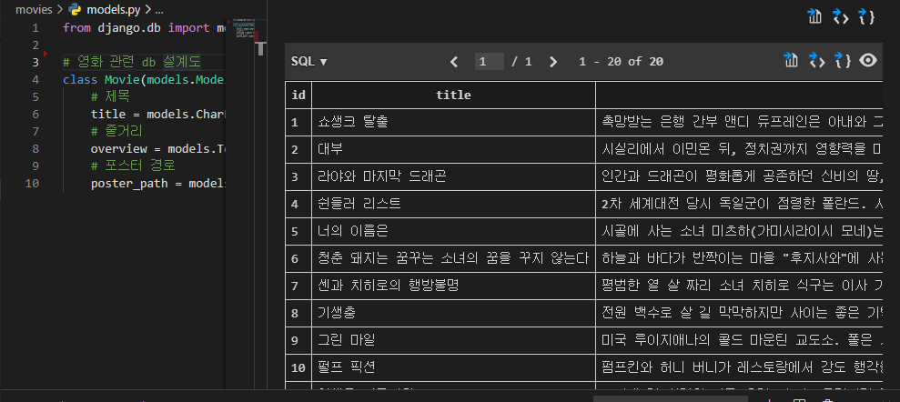
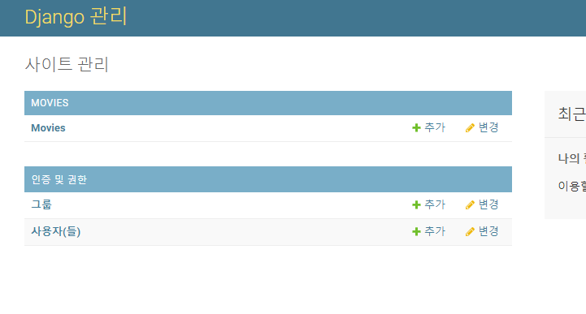
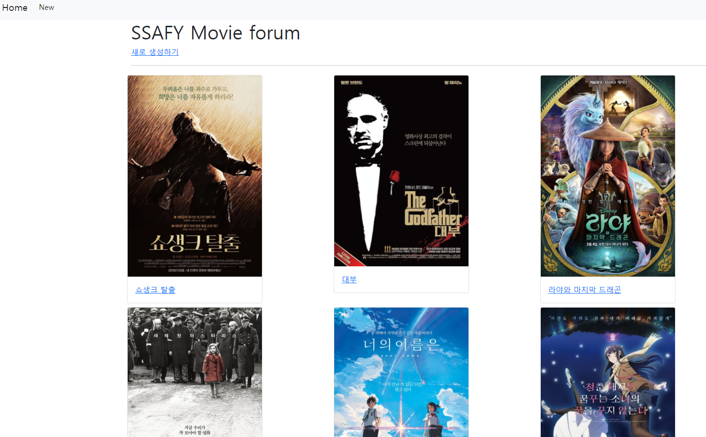
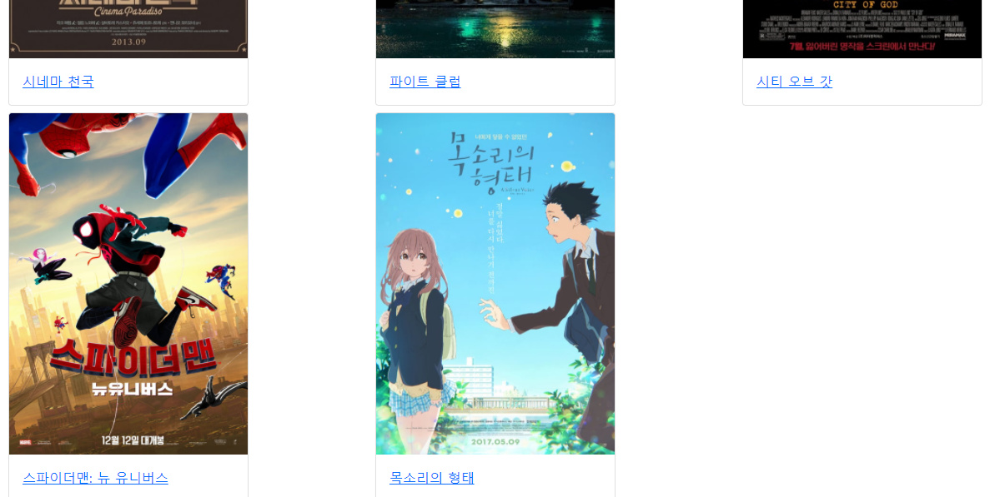
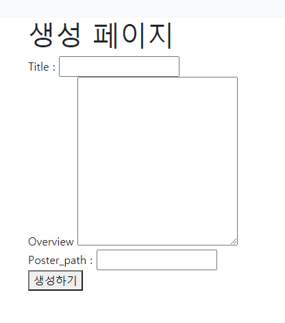
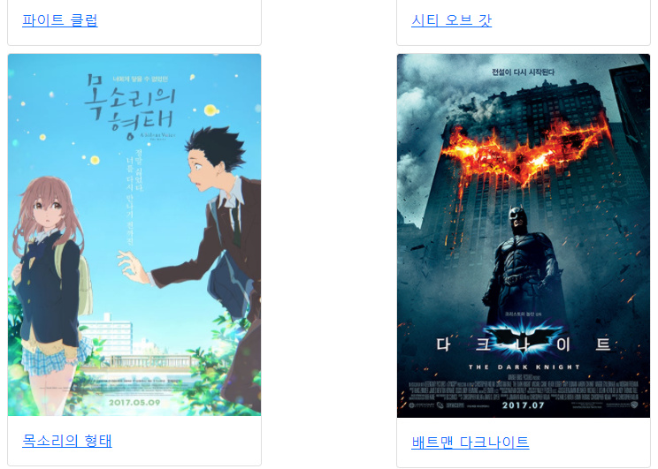
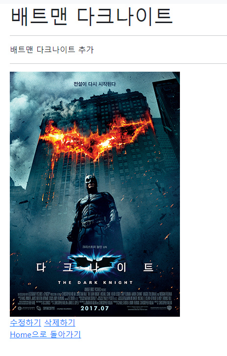
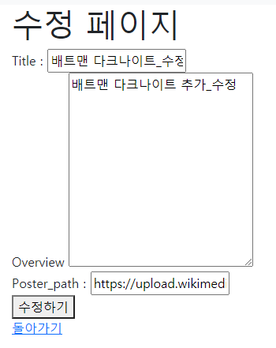
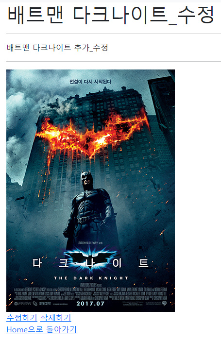
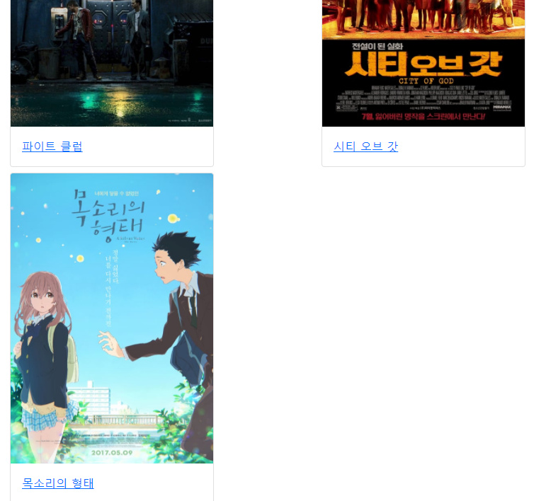

# 프레임워크 기반 웹페이지 구현 by 안병진


## 프로젝트 목표

- 데이터를 생성, 조회, 수정, 삭제 할 수 있는 Web Application 제작
- Python Web Framework를 통한 데이터 조작
- Object Relational Mapping에 대한 이해
- 관리자 페이지를 통한 관리


## 개발 환경 및 사용 데이터

- 개발 언어 - Python 3.8.7, Django 3.1.7
- 개발 환경 - Windows 10 64bit, vscode, chrome browser
- 사용 라이브러리 -  bootstrap
- 사용 데이터 - 제공받은 Movies.json (영화 db fixture)
- 개발 팀원 - 안병진(드라이버), 엄재식(네비게이터)


## 요구사항

> 커뮤니티 서비스의 게시판 기능 개발을 위한 단계로, 영화 데이터의 CRUD를 하는 로직을 완성합니다. 해당 기능은 향후 커뮤니티 서비스의 필수 기능으로 사용됩니다.


### A. 프로젝트 구조

> pjt04/은 startproject 명령어로 생성되는 project 디렉토리입니다.
>
> movies/는 startapp 명령어로 생성되는 application 디렉토리입니다.

#### 🙄 명세서를 읽고 든 생각

- 처음 프로젝트 생성 후 기본 세팅을 하는 작업이었습니다. startproject로 생성 후, vscode로 폴더를 열고, 이후에 세팅 및 startapp을 통한 movies 앱 생성, 가상환경을 위한 필요 요소를 파일로 저장하였습니다.

#### 📋 작업 순서

1. 처음 startproject로 메인프로젝트를 생성합니다.
2. venv를 통해 가상환경 설정 및 실행 후 가상환경에 django를 설치 해줍니다. 
3. pip freeze를 통해 requirements 파일을 생성합니다.
4. vscode로 폴더를 열고 startapp으로 앱을 생성합니다.
5. settings에 들어가 앱연결, 언어, 시간 등을 세팅합니다.

#### 📰 실제 코드

```bash
django-admin startproject pjt04
python -m venv venv
source venv/Scrips/activate
pip install django
pip freeze > requirements.txt
python manage.py startapp movies
```

```python
# pjt04/settings.py 변경
INSTALLED_APPS = [
    'movies',
    'django.contrib.admin',
    'django.contrib.auth',
    'django.contrib.contenttypes',
    'django.contrib.sessions',
    'django.contrib.messages',
    'django.contrib.staticfiles',
]

TEMPLATES = [
    {
        'BACKEND': 'django.template.backends.django.DjangoTemplates',
        'DIRS': [BASE_DIR / 'pjt04' / 'templates'],
        'APP_DIRS': True,
        'OPTIONS': {
            'context_processors': [
                'django.template.context_processors.debug',
                'django.template.context_processors.request',
                'django.contrib.auth.context_processors.auth',
                'django.contrib.messages.context_processors.messages',
            ],
        },
    },
]

LANGUAGE_CODE = 'ko-kr'

TIME_ZONE = 'Asia/Seoul'
```

#### 💡 느꼈던 점이나 어려웠던 부분, 추가사항

- venv를 처음 배우고 바로 실행해보는 첫 시간이라 조금 어색했고, 네비게이터 분이 조금 어렵게 느끼셔서 조금 설명해드리며 진행했습니다. freeze의 경우 프로젝트 시간내엔 하지 못했고 개인적으로 추가 했습니다.


### B. Model

> 정의할 모델 클래스의 이름은 Movie이며, 다음과 같은 정보를 저장합니다.
>
> title - String(<= 100) - 제목
> overview - Text - 줄거리
> poster_path - String(<= 500) - 포스터 경로

#### 🙄 명세서를 읽고 든 생각

- movies/model.py에서 해당 클래스를 생성하고 makemigrations로 설계도 작성, migrate로 db 생성하고 이후에 fixture에 더미 데이터를 넣고 불러오면 될 것이라 생각했습니다.

#### 📋 작업 순서

1. model.py 에 db 설계 요구사항에 맞게 클래스를 작성합니다.
2. makemigrations로 설계도를 작성 하고 migrate로 실제 db를 생성합니다.(반영)
3. 이후에 movies.json을 fixtures 폴더에 집어넣고 loaddata 명령을 통해 더미 데이터를 불러옵니다.

#### 📰 실제 코드

```python
# model.py
from django.db import models
# 영화 관련 db 설계도
class Movie(models.Model):
    # 제목
    title = models.CharField(max_length=100)
    # 줄거리
    overview = models.TextField()
    # 포스터 경로
    poster_path = models.CharField(max_length=500)
```

```bash
python manage.py makemigrations
python manage.py migrate
python manage.py loaddata movies/movies.json
```

#### 💡 느꼈던 점이나 어려웠던 부분, 추가사항

- 드라이버로서 설계까지는 무난하게 진행하였으나, 네비게이터 분이 loaddata에 대해 정확히 모르셔서 제가 설명을 하는 형태로 진행했습니다. 다만 loaddata 뒤의 부분을 제가 movies/movies.movie로 잘못 기억하고 있어서 제대로 불러오는데 애먹었었습니다.

#### 📇 결과




### C. Admin

> 위에서 정의한 모델 Movie는 관리자 페이지에서 데이터의 생성, 조회, 수정, 삭
> 제 가능해야 합니다.

#### 🙄 명세서를 읽고 든 생각

- movies/admin.py 에서 register를 통해 Movie 모델을 등록해주고, superuser를 생성해주면 될 것 같았습니다.

#### 📋 작업 순서

1. admin.py에서 admin.site.register(Movie) 를 통해 admin에서 Movie 모델을 접근하도록 등록해줍니다.
2. bash에서 슈퍼유저를 생성하고 admin 페이지를 들어 갈 수 있도록 해줍니다.

#### 📰 실제 코드

```python
# movies/admin.py
from django.contrib import admin
from .models import Article

# Register your models here.
admin.site.register(Article)
```

```bash
python manage.py createsuperuser
```

#### 💡 느꼈던 점이나 어려웠던 부분, 추가사항

- admin 생성 부분에 있어서 크게 어려운건 없었습니다만, 기존 프로젝트 시간에는 미처 고려하지 못할정도로 시간이 촉박하여, 개인적으로 추가하였습니다.

#### 📇 결과




### D. URL

> URL 패턴 설명
>
> /movies/ 전체 영화 목록 조회
>
> /movies/new/ 새로운 영화 작성 Form
>
> /movies/create/ 영화 데이터 저장
>
> /movies/<pk>/ 단일 영화 상세 조회
>
> /movies/<pk>/edit/ 단일 영화 수정 Form
>
> /movies/<pk>/update/ 수정된 영화 데이터 저장
>
> /movies/<pk>/delete/ 단일 영화 삭제

#### 🙄 명세서를 읽고 든 생각

- 일단 urls.py 관련 처리인것으로 알았습니다. 또 movies앱 에서 주로 사용되므로 메인프로젝트의 urls.py는 include로 연결만 해주면 될 것 같았습니다.

#### 📋 작업 순서

1. pjt04/urls.py에 include를 넣어 movies 앱 관련 url은 movies/urls.py 처리하도록 연결합니다.
2. movies/urls.py에 요구사항에 맞춰 path를 작성하고 views 를 import하여 연결합니다.
3. 다른 곳에서 사용하기 편리하게 하기 위해 app_name을 작성하고, name을 통해 별명을 지어줍니다.

#### 📰 실제 코드

```python
# pjt04/urls.py
from django.contrib import admin
from django.urls import path, include

urlpatterns = [
    path('admin/', admin.site.urls),
    # ~/movies/ 처리
    path('movies/', include('movies.urls')),
]

# movies/urls.py
from django.urls import path
from . import views
app_name = 'movies'
urlpatterns = [
    # 전체 영화 목록 조회 페이지
    path('', views.index, name='index'),
    # 새로운 영화 form 작성 페이지
    path('new/', views.new, name='new'),
    # 영화 데이터 저장 페이지
    path('create/', views.create, name='create'),
    # 영화 상세 페이지
    path('<int:pk>/', views.detail, name='detail'),
    # 영화 수정 데이터 폼 페이지
    path('<int:pk>/edit/', views.edit, name='edit'),
    # 영화 수정을 반영 하는 페이지
    path('<int:pk>/update/', views.update, name='update'),
    # 영화 정보 삭제 페이지
    path('<int:pk>/delete/', views.delete, name='delete'),
]
```

#### 💡 느꼈던 점이나 어려웠던 부분, 추가사항

- 이부분은 네비게이터 분도 크게 문제없이 진행했습니다. 다만 프로젝트 시간내에는 detail 까지 path만드는 데 시간이 벅차서 추후에 edit, update, delete는 개인적으로 추가했습니다.


### E. View & Template

> 크게 6가지 파트로 나뉘어 view와 template를 구성하도록 되어있습니다.

#### 🙄 명세서를 읽고 든 생각

- 기본적으로 주어진 파트의 명세서에 따라 구성하도록 되어있습니다.
- 먼저 views에서 해당 기능에 맞게 적절한 함수를 생성하고, template가 필요한 부분의 경우 html을 통해 적절하게 화면을 보여주도록 설정해줍니다.

#### 📰 실제 코드

#### 1. 공유 템플릿 생성 및 사용

> 1. 모든 HTML파일은 base.html을 확장(extends)하여 사용합니다.
>
> 2. base.html은 모든 페이지가 공유하는 상단 네비게이션 바를 표시합니다.
> 3. 네이게이션 바는 전체 영화 목록 조회 페이지와 새로운 영화 작성 페이지로 이동 할 수 있는 링크를 포함합니다.

```django
<!-- pjt04/base.html -->
<!DOCTYPE html>
<html lang="en">
<head>
  <meta charset="UTF-8">
  <meta http-equiv="X-UA-Compatible" content="IE=edge">
  <meta name="viewport" content="width=device-width, initial-scale=1.0">
  <title>Document</title>
  <link href="https://cdn.jsdelivr.net/npm/bootstrap@5.0.0-beta2/dist/css/bootstrap.min.css" rel="stylesheet" integrity="sha384-BmbxuPwQa2lc/FVzBcNJ7UAyJxM6wuqIj61tLrc4wSX0szH/Ev+nYRRuWlolflfl" crossorigin="anonymous">
</head>
<body>
 navbar 생성 
  <nav class="navbar navbar-expand-lg navbar-light bg-light">
  <div class="container-fluid">
    <a class="navbar-brand" href="">Home</a>
    <button class="navbar-toggler" type="button" data-bs-toggle="collapse" data-bs-target="#navbarSupportedContent" aria-controls="navbarSupportedContent" aria-expanded="false" aria-label="Toggle navigation">
      <span class="navbar-toggler-icon"></span>
    </button>
    <div class="collapse navbar-collapse" id="navbarSupportedContent">
      <ul class="navbar-nav me-auto mb-2 mb-lg-0">
        <li class="nav-item">
          <a class="nav-link active" aria-current="page" href="">New</a>
        </li>
      </ul>
    </div>
  </div>
</nav>
 실제 상속받아서 사용될 공간 
  <div class="container">   
    
    
  </div>
  <script src="https://cdn.jsdelivr.net/npm/bootstrap@5.0.0-beta2/dist/js/bootstrap.bundle.min.js" integrity="sha384-b5kHyXgcpbZJO/tY9Ul7kGkf1S0CWuKcCD38l8YkeH8z8QjE0GmW1gYU5S9FOnJ0" crossorigin="anonymous"></script>
</body>
</html>
```


#### 2. 전체 영화 목록 조회

> 1. 데이터베이스에 존재하는 모든 영화의 목록을 표시합니다.
> 2. 사용자에게 응답으로 제공할 HTML파일은 index.html 입니다.
> 3. index.html은 base.html을 확장합니다.
> 4. index.html에는 적절한 HTML요소를 사용하여 title과 포스터 이미지를 표시하며, title을 클릭 시 해당 영화의 상세 조회 페이지로 이동합니다.

```django

<!-- index.html -->

  <h1>SSAFY Movie forum</h1>
  <a href="">새로 생성하기</a>
  <hr>
   전체틀을 그리드로 잡아주고 
  <div class="row">
    
     각 뮤비 카드 마다 col을 지정해줘서 12초과시 다음줄 = 3개 나오고 다음줄로 배치 
      <div class="col-4 p-1">
        <div class="card" style="width: 18rem;">
          
          <div class="card-body">
            <a href="">{{ movie.title }}</a>
          </div>
        </div>
      </div>
    
  </div>


```

```python
# movies/views.py 
# index.html 로 렌더링
def index(request):
    movies = Movie.objects.all()
    context = {
        'movies': movies,
    }
    return render(request, 'movies/index.html', context)
```


#### 3. 새로운 영화 작성 Form

> 1. 사용자에게 응답으로 제공할 HTML파일은 new.html입니다.
> 2. new.html은 base.html을 확장합니다.
> 3. 영화를 작성할 수 있는 Form을 표시하며, 다음과 같은 input 요소들을
> 포함해야 합니다.
> 4. Form에 작성한 정보는 제출(submit)시, 사용자 제출 데이터를 저장하는
> /movies/<pk>/update/ 수정된 영화 데이터 저장
> /movies/<pk>/delete/ 단일 영화 삭제 URL로 요청과 함께 전송됩니다.

```django

<!-- new.html -->

  <h1>생성 페이지</h1>
  <form action="" method="post">
    
    <label for="title">Title : </label>
    <input type="text" name="title" id="title">
    <br>
    <label for="overview">Overview</label>
    <textarea name="overview" id="overview" cols="30" rows="10"></textarea>
    <br>
    <label for="poster_path">Poster_path : </label>
    <input type="text" name="poster_path" id="poster_path">
    <br>
    <button>생성하기</button>
  </form>


```

```python
# 입력 폼 페이지로 연결
def new(request):
    return render(request, 'movies/new.html')
```


#### 4. 영화 데이터를 저장

> 1. 요청과 함께 전송된 데이터를 데이터베이스에 저장합니다.
> 2. 저장이 완료되면 아래의 동작 중 하나를 선택하여 수행합니다.
> A. 전체 영화 목록 조회 페이지로 Redirect합니다.
> B. 저장한 영화의 상세 조회 페이지로 Redirect합니다.

```python
def create(request):
    # POST 일 때만 처리
    if request.method == 'POST':
        # form에서 보낸 데이터 가져오기
        title = request.POST.get('title')
        overview = request.POST.get('overview')
        poster_path = request.POST.get('poster_path')
        
        # 실제 DB 에 맞는 모델 클래스 생성 후 데이터를 넣고, DB에 반영
        movie = Movie()
        movie.title = title
        movie.overview = overview
        movie.poster_path = poster_path
        movie.save()

    # A. 작업이 끝나면 메인 화면(전체 영화 조회 페이지)으로 돌아가기
    return redirect('movies:index')
    # # B. 작업이 끝나면 상세 페이지로 가기
    # return redirect('movies:detail', movie.pk)
```


#### 5. 단일 영화 상세 조회

> 1. URL을 통해 함께 전달된 pk에 해당하는 영화 상세정보를 HTML에 표시
> 해야 합니다.
> 2. 사용자에게 응답으로 제공할 HTML은 detail.html입니다.
> 3. detail.html은 base.html을 확장합니다.
> 4. detail.html에는 적절한 HTML 요소를 사용하여, 조회하는 영화의 title,
> overview, poster_path를 표시합니다.

```django

<!-- detail.html -->

  <h1>{{ movie.title }}</h1>
  <hr>
  <p>{{ movie.overview }}</p>
  <hr>
  
  <br>
  <a href="">수정하기</a>
  <a href="">삭제하기</a>
  <br>
  <a href="">Home으로 돌아가기</a>

```

```python
# 상세 페이지 - pk를 통해 데이터를 가져와서 html 연결후 데이터를 전달해준다.
def detail(request, pk):
    # movie = Movie.objects.get(pk=pk)
    movie = get_object_or_404(Movie, pk=pk)
    context = {
        'movie': movie,
    }
    return render(request, 'movies/detail.html', context)
```


#### 6. 추가기능

> 1. 단일영화 정보를 수정하고 삭제하는 기능을 추가합니다.

```django

<!-- edit.html -->
<!-- 정보를 수정하고 삭제하는 페이지 중에서 html이 필요한 페이지는 정보 수정을 위한 form 페이지 밖에 없습니다. -->

  <h1>수정 페이지</h1>
  <form action="" method="post">
    
    <label for="title">Title : </label>
    <input type="text" name="title" id="title" value="{{ movie.title }}">
    <br>
    <label for="overview">Overview</label>
    <textarea name="overview" id="overview" cols="30" rows="10">{{ movie.overview }}</textarea>
    <br>
    <label for="poster_path">Poster_path : </label>
    <input type="text" name="poster_path" id="poster_path" value="{{ movie.poster_path }}">
    <br>
    <button>수정하기</button>
  </form>
    <a href="">돌아가기</a>

```

```python
# 수정 폼 입력 페이지
def edit(request, pk):
    movie = get_object_or_404(Movie, pk=pk)

    context = {
        'movie': movie,
    }
    return render(request, 'movies/edit.html', context)

# 수정 db에 반영하는 페이지
def update(request, pk):
    # POST 일 때만 처리
    if request.method == 'POST':
        # form에서 보낸 데이터 가져오기
        title = request.POST.get('title')
        overview = request.POST.get('overview')
        poster_path = request.POST.get('poster_path')
        
        # id가 일치하는 행을 가져와서 그 부분의 정보를 수정 후 반영
        movie = get_object_or_404(Movie, pk=pk)
        movie.title = title
        movie.overview = overview
        movie.poster_path = poster_path
        movie.save()
    # 상세 페이지에서 변경 되었는지 확인하도록, pk 값을 인자로 같이 넘겨줌(db 찾기용)
    return redirect('movies:detail', pk)

# 삭제 페이지
def delete(request, pk):
    # 해당하는 행을 가져와서 삭제
    movie = get_object_or_404(Movie, pk=pk)
    movie.delete()
    # 삭제 후 처음 화면으로 돌아가기
    return redirect('movies:index')
```

#### 💡 느꼈던 점이나 어려웠던 부분, 추가사항

- 네비게이터 분과는 생성 페이지를 작성하던 부분에서 시간이 종료되어 마무리 지었고, 이후의 부분은 개인적으로 추가하거나 수정하는 방법으로 진행 했습니다.
- 다른 부분은 크게 어려운 파트가 없었습니다만, 메인 화면에서 카드형으로 배치를 하였는데 그리드 시스템이 처음엔 의도한 대로 한줄에 3~4개씩 보여주지 않아 고민했었습니다.
- 생각해보니 전체를 div로 감싸고 row로 생성해주고 각 카드를 col로 지정해주면 카드가 그리드 범위(12)가 넘었을 때 자동으로 다음 화면으로 보여주지 않을까 생각했고 의도된 대로 배치할 수 있었습니다.
- 기본적으로 일주일간 배웠던 내용을 복습하는 느낌이라서 엄청 어렵게 진행하진 않았던 것 같습니다.

#### 📇 결과


##### 메인 페이지 




##### 메인 페이지 최하단(처음 실행시)




##### 생성 페이지




##### 생성 후 메인 페이지




##### 상세 페이지




##### 수정 페이지




##### 수정 후 상세 페이지




##### 삭제 후 메인 페이지

