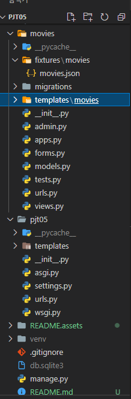
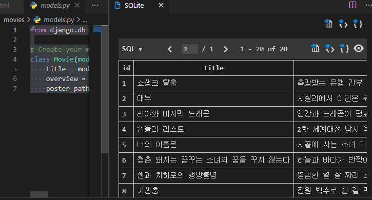
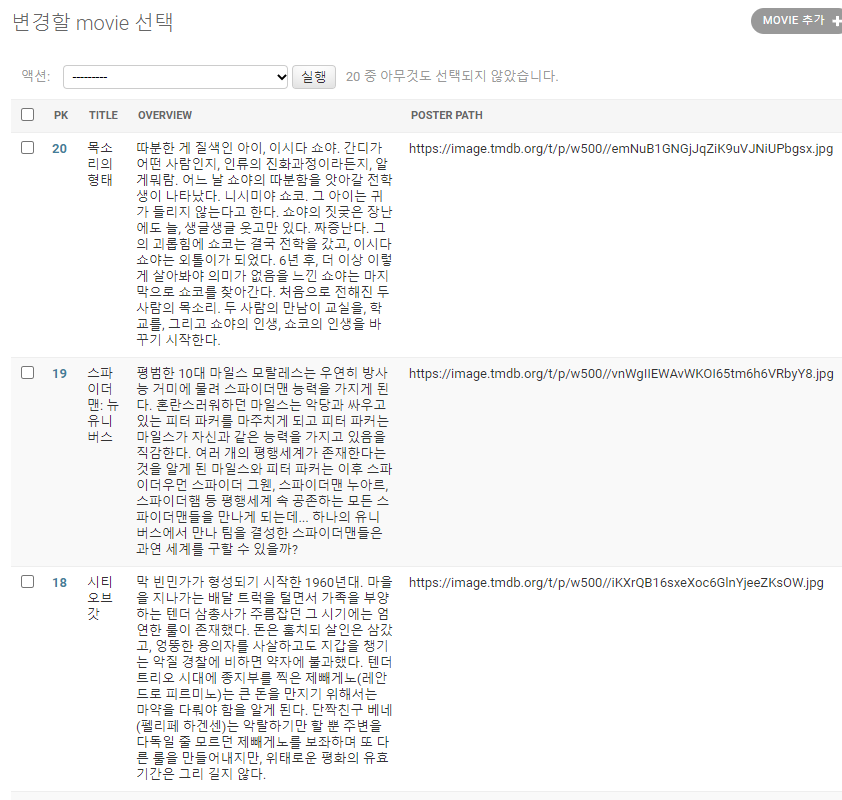
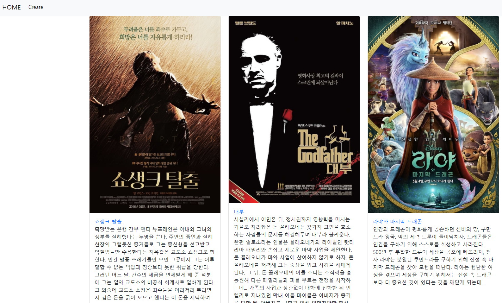
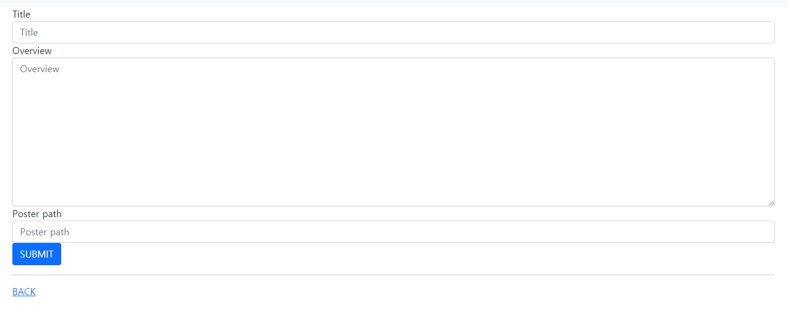
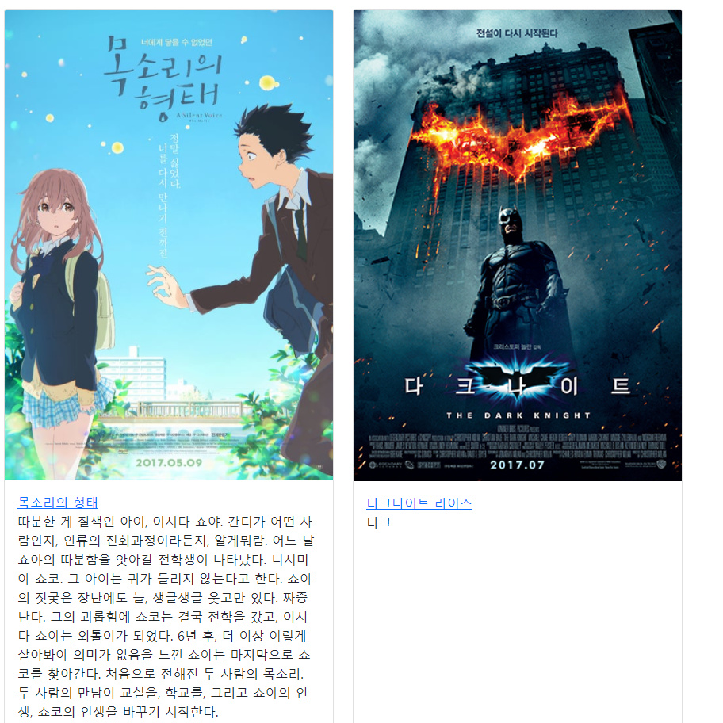
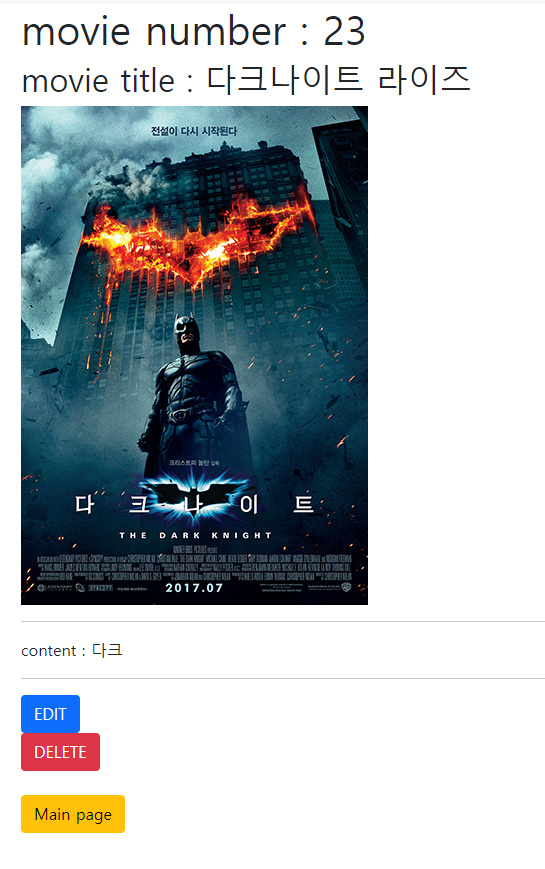
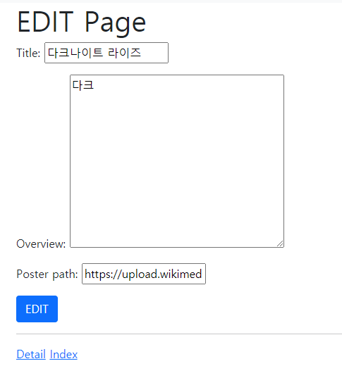
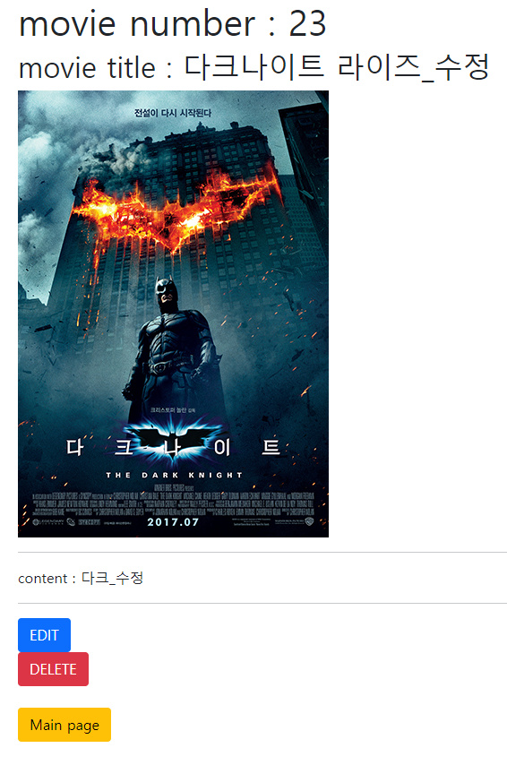
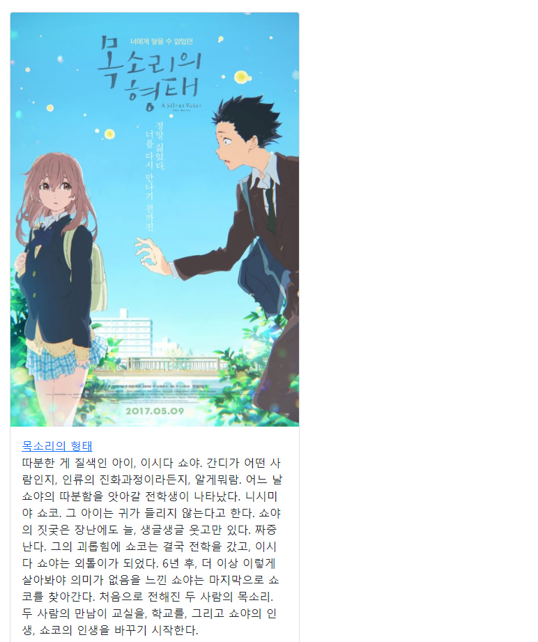

# 프레임워크 기반 웹페이지 구현 by 안병진


## 프로젝트 목표

- 데이터를 생성, 조회, 수정, 삭제 할 수 있는 Web Application 제작
- Python Web Framework를 통한 데이터 조작
- Object Relational Mapping에 대한 이해
- Django ModelForm을 활용한 HTML과 사용자 요청 데이터 관리


## 개발 환경 및 사용 데이터

- 개발 언어 - Python 3.8.7, Django 3.1.7
- 개발 환경 - Windows 10 64bit, vscode
- 사용 라이브러리 - requirements.txt 참조
- 사용 데이터 - 사전에 제공 받은 movies.json
- 개발 팀원 - 안병진, 천주용


## 요구사항

> 커뮤니티 서비스의 게시판 기능 개발을 위한 단계로, 영화 데이터의 CRUD를 하는 로직을 완성합니다. 해당 기능은 향후 커뮤니티 서비스의 필수 기능으로 사용됩니다.


### A. 프로젝트 구조

> pjt05/은 startproject 명령어로 생성되는 project 디렉토리입니다.
>
> movies/는 startapp 명령어로 생성되는 application 디렉토리입니다.

#### 🙄 명세서를 읽고 든 생각

- 처음 프로젝트 생성 후 기본 세팅을 하는 작업이었습니다. startproject로 생성 후, vscode로 폴더를 열고, 이후에 가상 환경 구축 및 startapp을 통한 movies 앱 생성, 세팅 파일을 수정 후 저장하였습니다.

#### 📋 작업 순서

1. 처음 startproject로 메인프로젝트를 생성합니다.
2. venv를 통해 가상환경 설정 및 실행 후 가상환경에 django를 설치 해줍니다. 
3. pip freeze를 통해 requirements 파일을 생성합니다.
4. vscode로 폴더를 열고 startapp으로 앱을 생성합니다.
5. settings에 들어가 앱 연결, 언어, 시간 등을 세팅합니다.

#### 📰 실제 코드

```bash
$ django-admin startproject pjt05
$ python -m venv venv
$ source venv/Scrips/activate
$ pip install django
$ pip install django-bootstrap-v5
$ pip freeze > requirements.txt
$ python manage.py startapp movies
```

#### 💡 느꼈던 점이나 어려웠던 부분, 추가사항

- 지난 주와 크게 다른 점이 없었기 때문에 크게 어려운 점은 없었습니다. 추가적으로 bootstrap 라이브러리를 사용하기 위해 추가했던 점이 차이가 있었습니다.

#### 📇 결과

##### 폴더 구조




### B. Model

> 정의할 모델 클래스의 이름은 Movie이며, 다음과 같은 정보를 저장합니다.
>
> title - String(<= 100) - 제목
> overview - Text - 줄거리
> poster_path - String(<= 500) - 포스터 경로

#### 🙄 명세서를 읽고 든 생각

- movies/model.py에서 해당 클래스를 생성하고 makemigrations로 설계도 작성, migrate로 db 생성하고 이후에 fixture에 더미 데이터를 넣고 불러오면 될 것이라 생각했습니다.

#### 📋 작업 순서

1. model.py 에 db 설계 요구사항에 맞게 클래스를 작성합니다.
2. makemigrations로 설계도를 작성 하고 migrate로 실제 db를 생성합니다.(반영)
3. 이후에 movies.json을 fixtures 폴더에 집어넣고 loaddata 명령을 통해 더미 데이터를 불러옵니다.

#### 📰 실제 코드

```python
from django.db import models

# Create your models here.
class Movie(models.Model):
    title = models.CharField(max_length=100)
    overview = models.TextField()
    poster_path = models.CharField(max_length=500)
```

```bash
python manage.py makemigrations
python manage.py migrate
python manage.py loaddata movies/movies.json
```

#### 💡 느꼈던 점이나 어려웠던 부분, 추가사항

- 지난 주와 크게 달라진 부분이 없어서 진행하는데 무리는 없었습니다.

#### 📇 결과




### C. Form

> Movie의 데이터 검증, 저장, 에러메세지, HTML을 모두 관리하기 위해 ModelForm을 사용합니다. 해당 ModelForm은 title, overview, poster_path 필드를 검증 및 HTML로 표시합니다.

#### 🙄 명세서를 읽고 든 생각

- 이번 주에 새로 배운 djnago form을 이용하여 form을 쉽게 생성할 수 있는데 그것의 실습이라고 생각했습니다. 두가지 form 형태 중 모델의 데이터를 받는 ModelForm을 생성하였습니다.

#### 📋 작업 순서

1. forms.py 에서 장고 폼을 import 합니다.
2. 사용할 모델(여기선 Movie)을 import 합니다.
3. 사용할 모델에 맞춰 클래스를 생성합니다. 이 때 모델 폼을 사용하므로 메타 클래스 생성을 통해 어떤 모델과 연결된 클래스인지 알려줘야 합니다.

#### 📰 실제 코드

```python
from django import forms
from .models import Movie

class MovieForm(forms.ModelForm):
    class Meta:
        model = Movie
        fields = '__all__'
```

#### 💡 느꼈던 점이나 어려웠던 부분, 추가사항

- form을 배운 지 얼마 되지 않아 많이 사용해보지 않았기 때문에 조금 어색했습니다만, 기억을 토대로 팀원분과 의사소통하며 잘 진행할 수 있었습니다.


### D. Admin

> 위에서 정의한 모델 Movie는 관리자 페이지에서 데이터의 생성, 조회, 수정, 삭제 가능해야 합니다.

#### 🙄 명세서를 읽고 든 생각

- movies/admin.py 에서 register를 통해 Movie 모델을 등록해주고, superuser를 생성해주면 될 것 같았습니다. 이번엔 추가적으로 ModelAdmin 클래스를 통해 admin 상에서 db 데이터를 좀 더 보기 쉽게 정리 해주 었습니다.

#### 📋 작업 순서

1. admin.py에서각 필드를 알아보기 쉽게 MovieAdmin 클래스를 통해 속성별로 리스트를 보여주도록 설정합니다. 
2. admin.site.register(Movie) 를 통해 admin에서 Movie 모델을 접근하도록 등록해줍니다.
3. bash에서 슈퍼유저를 생성하고 admin 페이지를 들어 갈 수 있도록 해줍니다.

#### 📰 실제 코드

```python
# movies/admin.py
from django.contrib import admin
from .models import Movie

class MovieAdmin(admin.ModelAdmin):
    list_display = ('pk', 'title', 'overview', 'poster_path')

admin.site.register(Movie, MovieAdmin)
```

```bash
python manage.py createsuperuser
```

#### 💡 느꼈던 점이나 어려웠던 부분, 추가사항

- admin 생성 부분은 크게 어렵게 느끼지 않았습니다만, 아직  ModelAdmin을 사용하는 것은 어색해서 좀  더 연습이 필요하다고 느꼈습니다.

#### 📇 결과




### E. URL

> URL 패턴 설명
>
> GET /movies/ 전체 영화 목록 조회
>
> GET & POST /movies/create/Form 표시 및 영화 데이터 생성
>
> GET /movies/<pk>/ 단일 영화 상세 조회
>
> GET & POST /movies/<pk>/update/ Form 표시 및 영화 데이터 수정
>
> POST /movies/<pk>/delete/ 단일 영화 삭제

#### 🙄 명세서를 읽고 든 생각

- 일단  movies앱 에서 주로 사용되므로 메인프로젝트의 urls.py는 include로 연결만 해주면 될 것 같았습니다.  또 movies/urls.py에서 path를 이용하여 각각에 해당하는 url을 생성 해줍니다.

#### 📋 작업 순서

1. pjt05/urls.py에 include를 넣어 movies 앱 관련 url은 movies/urls.py 처리하도록 연결합니다.
2. movies/urls.py에 요구사항에 맞춰 path를 작성하고 views 를 import하여 연결합니다.
3. 다른 곳에서 사용하기 편리하게 하기 위해 app_name을 작성하고, name을 통해 별명을 지어줍니다.

#### 📰 실제 코드

```python
# pjt05/urls.py
from django.contrib import admin
from django.urls import path,include
urlpatterns = [
    path('admin/', admin.site.urls),
    path('movies/', include('movies.urls')),
]

# movies/urls.py
from django.urls import path
from . import views
app_name= 'movies'
urlpatterns = [
    path('', views.index, name='index'),
    path('create/', views.create, name='create'),
    path('<int:pk>/', views.detail, name='detail'),
    path('<int:pk>/delete', views.delete, name='delete'),
    path('<int:pk>/update', views.update, name='update'),
]
```

#### 💡 느꼈던 점이나 어려웠던 부분, 추가사항

- 장고 관련 수업을 시작할 때 부터 수 차례 반복했기 때문인지, 제가 네비게이터 일때도, 팀원분이 네비게이터 일때도 큰 무리없이 진행 했던 것 같습니다.


### F. View & Template

> 크게 6가지 파트로 나뉘어 view와 template를 구성하도록 되어있습니다.

#### 🙄 명세서를 읽고 든 생각

- 기본적으로 주어진 파트의 명세서에 따라 구성하도록 되어있습니다.
- 먼저 views에서 해당 기능에 맞게 적절한 함수를 생성하고, template가 필요한 부분의 경우 html을 통해 적절하게 화면을 보여주도록 설정해줍니다.
- 다만 이번에는 이번 주에 배웠던 내용을 토대로 post와 get으로 요청을 나눠 처리하도록해 2개의 함수를 통합해 사용하는 방법 및 get_object_or_404나 데코레이터 등을 이용하여 좀 더 단단한 사이트를 구축하도록 변경하였습니다.

#### 📰 실제 코드

#### 1. 공유 템플릿 생성 및 사용

> 1. 모든 HTML파일은 base.html을 확장(extends)하여 사용합니다.
>
> 2. base.html은 모든 페이지가 공유하는 상단 네비게이션 바를 표시합니다.
> 3. 네이게이션 바는 전체 영화 목록 조회 페이지와 새로운 영화 작성 페이지로 이동 할 수 있는 링크를 포함합니다.

```django
<!-- pjt05/base.html -->
<!DOCTYPE html>
<html lang="en">
<head>
  <meta charset="UTF-8">
  <meta http-equiv="X-UA-Compatible" content="IE=edge">
  <meta name="viewport" content="width=device-width, initial-scale=1.0">
  <link href="https://cdn.jsdelivr.net/npm/bootstrap@5.0.0-beta2/dist/css/bootstrap.min.css" rel="stylesheet" integrity="sha384-BmbxuPwQa2lc/FVzBcNJ7UAyJxM6wuqIj61tLrc4wSX0szH/Ev+nYRRuWlolflfl" crossorigin="anonymous">
  <title>Document</title>
</head>
<body>
  <nav class="navbar navbar-expand-lg navbar-light bg-light">
    <div class="container-fluid">
      <a class="navbar-brand" href="">HOME</a>
      <button class="navbar-toggler" type="button" data-bs-toggle="collapse" data-bs-target="#navbarNav" aria-controls="navbarNav" aria-expanded="false" aria-label="Toggle navigation">
        <span class="navbar-toggler-icon"></span>
      </button>
      <div class="collapse navbar-collapse" id="navbarNav">
        <ul class="navbar-nav">
          <li class="nav-item">
            <a class="nav-link active" aria-current="page" href="">Create</a>
          </li>
        </ul>
      </div>
    </div>
  </nav>
  <div class="container">
    
  </div>
  <script src="https://cdn.jsdelivr.net/npm/bootstrap@5.0.0-beta2/dist/js/bootstrap.bundle.min.js" integrity="sha384-b5kHyXgcpbZJO/tY9Ul7kGkf1S0CWuKcCD38l8YkeH8z8QjE0GmW1gYU5S9FOnJ0" crossorigin="anonymous"></script>
</body>
</html>
```


#### 2. 전체 영화 목록 조회

> 1. 데이터베이스에 존재하는 모든 영화의 목록을 표시합니다.
> 2. 사용자에게 응답으로 제공할 HTML파일은 index.html 입니다.
> 3. index.html은 base.html을 확장합니다.
> 4. index.html에는 적절한 HTML요소를 사용하여 title과 포스터 이미지를 표시하며, title을 클릭 시 해당 영화의 상세 조회 페이지로 이동합니다.

```django
<!-- index.html -->



  <div class="row row-cols-1 row-cols-md-3 g-4">
    
    <div class="col">
      <div class="card h-100">
        
        <div class="card-body">
          <a class="card-title" href="">{{movie.title}}</a>
          <p class="card-text">{{movie.overview}}</p>
        </div>
      </div>
    </div>
    
  </div>

```

```python
# movies/views.py 
@require_GET
def index(request):
    movies = Movie.objects.all()
    context = {
        'movies':movies,
    }
    return render(request,'movies/index.html',context)
```


#### 3. 새로운 영화 작성 (GET)

> 1. 사용자에게 응답으로 제공할 HTML파일은 create.html or form.html입니다.
> 2. new.html은 base.html을 확장합니다.
> 3. 영화를 작성할 수 있는 Form을 표시하며, 다음과 같은 input 요소들을
>    포함해야 합니다.
> 4. Form에 작성한 정보는 제출(submit)시, 사용자 제출 데이터를 저장하는 URL로 요청과 함께 전송됩니다.

```django
<!-- create.html -->




<form method="post" enctype="multipart/form-data">
  
  

  <button class='btn btn-primary' >SUBMIT</button>
</form>
<hr>
<a href="">BACK</a>

```


#### 4. 영화 데이터를 저장

> 1. ModelForm을 이용하여 요청과 함께 전송된 데이터를 데이터베이스에 저장합니다.
>
> 2. 저장이 완료되면 아래의 동작 중 하나를 선택하여 수행합니다.
>
>    A. 전체 영화 목록 조회 페이지로 Redirect합니다.
>
>    B. 저장한 영화의 상세 조회 페이지로 Redirect합니다.

```python
@require_http_methods(["GET", "POST"])
def create(request):
    if request.method == 'POST':
        form = MovieForm(request.POST)
        if form.is_valid():
            form.save()
            return redirect('movies:index')
    else:
        form = MovieForm()
    context = {
        'form':form,
    }
    return render(request,'movies/create.html',context)
```


#### 5. 단일 영화 상세 조회

> 1. URL을 통해 함께 전달된 pk에 해당하는 영화 상세정보를 HTML에 표시
>    해야 합니다.
> 2. 사용자에게 응답으로 제공할 HTML은 detail.html입니다.
> 3. detail.html은 base.html을 확장합니다.
> 4. detail.html에는 적절한 HTML 요소를 사용하여, 조회하는 영화의 title,
>    overview, poster_path를 표시합니다.

```django
<!-- detail.html -->



  <h1>movie number : {{movie.pk}}</h1>
  <h2>movie title : {{movie.title}}</h2>
  
  <hr>
  <p>content : {{movie.overview}}</p>
  <hr>

  <a class='btn btn-primary' href="">EDIT</a>
   <a class='btn btn-danger' href="">DELETE</a> 
  <form action="" method="post">
    
    <button class="btn btn-danger">DELETE</button>
  </form>
  <br>
  <a class='btn btn-warning' href="">Main page</a>


```

```python
@require_GET
def detail(request,pk):
    movie = get_object_or_404(Movie,pk=pk)
    context = {
        'movie':movie,
    }
    return render(request, 'movies/detail.html', context)
```


#### 6. 영화 데이터 수정 (GET)

> 1. 사용자에게 응답으로 제공할 HTML파일은 update.html or form.html입니다.
> 2. URL을 통해 함께 전달된 pk를 pk(id)로 갖는 영화를 수정합니다.
> 3. 영화를 수정 할 수 있는 Form과 기존의 영화 데이터를 표시하며, ModelForm을 이용하여 다음과 같은 input 요소들을 포함해야 합니다.
> 4. Form에 작성한 정보는 제출(submit)시, POST 방식으로 요청과 데이터를 적절한 URL로 전송합니다.

```django
<!-- update.html -->



  <h1>EDIT Page</h1>
     {{ request.resolver_match }} 
  <form action="" method="POST">
    
    {{form.as_p}}
    <button class="btn btn-primary">EDIT</button>
  </form>
  <hr>
  <a href="">Detail</a>
  <a href="">Index</a>


```


#### 7. 영화 데이터 수정 (POST)

> 1. ModelForm을 이용하여 데이터를 검증하고 데이터가 유효하다면 요청과 함께 전성된 데이터를 데이터베이스에 저장하고 상세 조회 페이지로 Redirect합니다.
> 2. 데이터가 유효하지 않다면 에러 메시지를 포함하여 데이터를 작성하는 Form을 표시합니다.

```python
@require_http_methods(['GET', 'POST'])
def update(request, pk):
    movie = get_object_or_404(Movie, pk=pk)
    if request.method == 'POST':
        form = MovieForm(request.POST, instance=movie)
        if form.is_valid():
            form.save()
            return redirect('movies:detail', movie.pk)
    else:
        form = MovieForm(instance=movie)
    context = {
        'form': form,
        'movie': movie,
    }
    return render(request, 'movies/update.html', context)
```


#### 8. 영화 데이터 삭제

> 1. URL을 통해 함께 전달된 pk를 pk(id)로 갖는 영화를 삭제합니다.
> 2. HTTP method는 GET과 POST 중 선택하여 구성합니다.
> 3. 삭제가 완료되면 전체 영화 목록 조회 페이지로 Redirect합니다.

```python
@require_POST
def delete(request, pk):
    movie = get_object_or_404(Movie, pk=pk)
    movie.delete()
    return redirect('movies:index')
```


#### 💡 느꼈던 점이나 어려웠던 부분, 추가사항

- 전반적으로 지난 주에 배웠던 내용을 기반으로 이번주에 배웠던 내용을 추가한 형태로 진행 되어서 크게 어렵진 않았습니다.
- 다만 시간 상 poster_path를 통해 입력을 받아 Media 파일로 처리를 한다던지, static 기능을 사용해본 다던지, 좀 더 사이트 ui를 부트스트랩을 통해 예쁘게 꾸미지 못한 점이 다소 아쉽게 느껴졌습니다.
- views.py 에서 import 로 추가되는 내용 중 데코레이터 부르는 부분의 함수가 꽤 길어 기억이 잘 나지 않아 처음에 조금 당황했습니다. 여러 번 반복 숙달을 통해 외울 수 있도록 노력 해야겠습니다.


#### 📇 결과


##### 메인 페이지 



##### 생성 페이지



##### 생성 후 메인 페이지



##### 상세 페이지



##### 수정 페이지



##### 수정 후 상세 페이지



##### 삭제 후 메인 페이지



