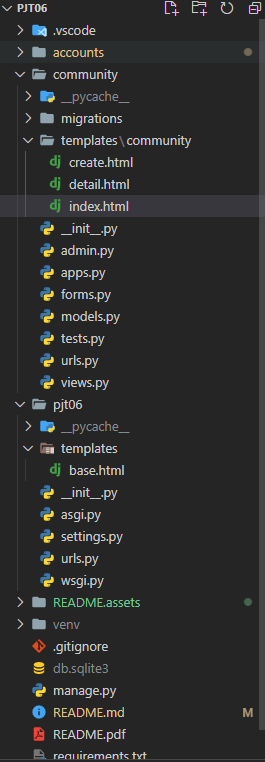
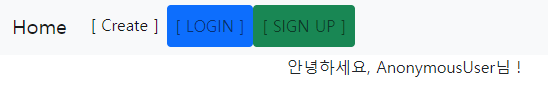
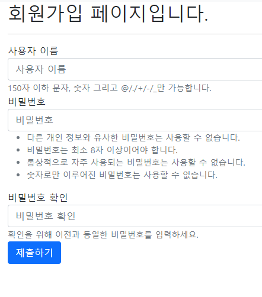
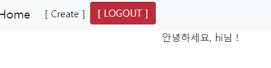
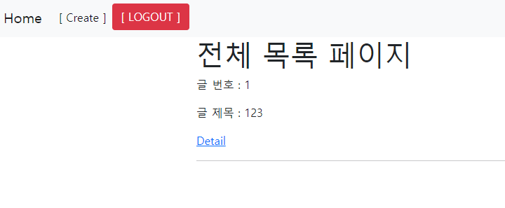
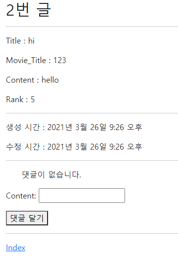
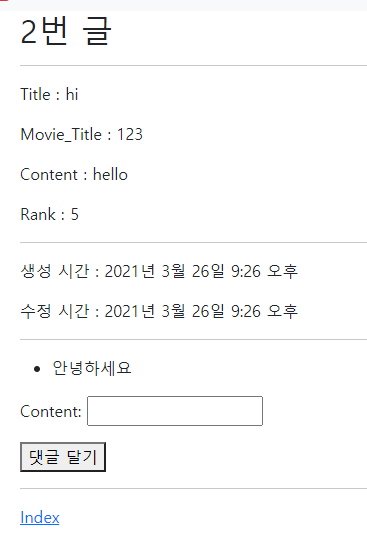

# 사용자인증 기반 웹 페이지 구현 by 안병진


## 프로젝트 목표

- 데이터를 생성, 조회, 수정, 삭제 할 수 있는 Web Application 제작
- Python Web Framework를 통한 데이터 조작
- Authentication에 대한 이해
- Database 1:N의 이해와 데이터 관계 설정


## 개발 환경 및 사용 데이터

- 개발 언어 - Python 3.8.7
- 개발 환경 - Windows 10 64bit, vscode

- 사용 라이브러리 - requirements.txt 참조
- 개발 팀원 - 안병진, 엄재식


## 요구사항

> 커뮤니티 서비스의 회원관련 기능 개발을 위한 단계로, 모델간의 관계 설정 후 데이터의 생성, 조회, 수정, 삭제 할 수 있는 기능을 완성합니다. 해당 기능은 향후 커뮤니티 서비스의 필수 기능으로 사용됩니다.


### A. 프로젝트 구조

> pjt06/은 startproject 명령어로 생성되는 project 디렉토리입니다. 
>
> community/는 startapp 명령어로 생성되는 application 디렉토리입니다. 
>
> 아래의 폴더구조는 주요한 폴더와 파일만 명시되어 있습니다.

#### 🙄 명세서를 읽고 든 생각

- 처음 프로젝트 생성 후 기본 세팅을 하는 작업이었습니다. startproject로 생성 후, vscode로 폴더를 열고, 이후에 가상 환경 구축 및 startapp을 통한 accounts, community 앱 생성, 세팅 파일을 수정 후 저장하였습니다.

#### 📋 작업 순서

1. 처음 startproject로 메인프로젝트를 생성합니다.
2. venv를 통해 가상환경 설정 및 실행 후 가상환경에 django를 설치 해줍니다. 
3. pip freeze를 통해 requirements 파일을 생성합니다.
4. vscode로 폴더를 열고 startapp으로 앱을 생성합니다.
5. settings에 들어가 앱 연결, 언어, 시간 등을 세팅합니다.

#### 📰 실제 코드

```bash
$ django-admin startproject pjt06
$ python -m venv venv
$ source venv/Scrips/activate
$ pip install django
$ pip install django-bootstrap-v5
$ pip freeze > requirements.txt
$ python manage.py startapp accounts
$ python manage.py startapp community
```

#### 💡 느꼈던 점이나 어려웠던 부분, 추가사항

- 프로젝트를 생성하고 기본 세팅을 하는 부분은 여러차례 프로젝트를 통해 다루었기 때문에 큰 무리 없이 진행했습니다.

#### 📇 결과



---


### B. Accounts

> Model - 사용자(User) 모델은 django에서 기본 제공하는 모델을 사용합니다.
>
> Form - User의 데이터 검증, 저장, 에러메세지, HTML을 모두 관리하기 위해 django에서 제공하는 ModelForm, Form을 사용합니다.
>
> Url -
>
> GET & POST /signup/ Form 표시 및 신규 사용자 생성(회원가입)
>
> GET & POST /login/ Form 표시 및 기존 사용자 인증(로그인)
>
> GET / POST /logout/ 인증된 사용자 인증 해제(로그아웃)

#### 📋 작업 순서

1. 커스텀 User 모델을 사용하기 위해 필요한 부분을 채웁니다. (Models, settings, admin)
2. 커스텀 User 모델과 연결할 CustomUserCreationForm을 생성합니다.
3. 명세서에 따른 urls를 생성합니다.
4. urls에 맞춘 기능들을 구현합니다.

#### 📰 실제 코드

```python
# accounts/admin.py
from django.contrib import admin
from django.contrib.auth.admin import UserAdmin
from .models import User

admin.site.register(User, UserAdmin)

# accounts/models.py
from django.db import models
from django.contrib.auth.models import AbstractUser

class User(AbstractUser):
    pass

# accounts/forms.py
from django.contrib.auth.forms import UserCreationForm
from django.contrib.auth import get_user_model


class CustomUserCreationFrom(UserCreationForm):

    class Meta(UserCreationForm.Meta):
        model = get_user_model()
        fields = UserCreationForm.Meta.fields


# accounts/urls.py
from django.urls import path
from . import views

app_name = 'accounts'

urlpatterns = [
    path('', views.index, name='index'),
    path('signup/', views.signup, name='signup'),
    path('login/', views.login, name='login'),
    path('logout/', views.logout, name='logout'),
]
```

```django
<!-- forms.html -->






  
    <h2>회원가입 페이지입니다.</h2>
  
    <h2>로그인 페이지입니다.</h2>
  
  <hr>

  <form action="" method='post'>
    
    
    <button class='btn btn-primary'>제출하기</button>
  </form>



<!-- 테스트 용 index -->



<p>안녕하세요, {{ request.user }}님 !</p>


```

```python
# accounts/views.py
from django.shortcuts import render, redirect
from .forms import CustomUserCreationFrom
from django.contrib.auth.forms import UserCreationForm, AuthenticationForm
from django.views.decorators.http import require_POST, require_http_methods, require_safe
from django.contrib.auth import login as auth_login, logout as auth_logout
from django.contrib.auth.decorators import login_required


def index(request):
    return render(request, 'accounts/index.html')


@require_http_methods(['GET', 'POST'])
def signup(request):
    if request.method == 'POST':
        form = CustomUserCreationFrom(request.POST)
        if form.is_valid():
            user = form.save()
            auth_login(request, user)
            return redirect('accounts:index')

    else:
        form = CustomUserCreationFrom()
    context = { 'form': form }
    return render(request, 'accounts/forms.html', context)


@login_required
@require_http_methods(['GET', 'POST'])
def login(request):
    if request.user.is_authenticated:
        return redirect('accounts:index')

    if request.method == 'POST':
        form = AuthenticationForm(request, request.POST)
        if form.is_valid():
            auth_login(request, form.get_user())
            return redirect('accounts:index')

    else:
        form = AuthenticationForm()
    context = { 'form': form }
    return render(request, 'accounts/forms.html', context)


@require_POST
def logout(request):
    if request.user.is_authenticated:
        auth_logout(request)
    return redirect('accounts:index')
```

#### 💡 느꼈던 점이나 어려웠던 부분, 추가사항

- 이번 주 수업에서 배웠던 내용을 복습하는 느낌으로 진행했습니다만, 생각보다 import 호출 구문도 잘 기억나지 않고, 막상 함수 작성할 때 의외로 막힐때가 많아 역시 여러번 반복 숙달을 통해 자연스럽게 쓸 수 있도록 연습하는게 필요하다고 느꼈습니다.
- 특히 막혔던 부분이 크게 3 곳 이었는데 처음에 커스텀 모델을 작성할 때 맞나 아닌가 긴가민가 하면서 작성하느라 느려졌고, 두 번째로는 커스텀 모델 후 db에 저장할 때 커스텀 폼을 만들지 않아서 제대로 작동을 하지 않아 폼을 만드는데, 정확히 기억나질 않아 헤매가면서 진행했던 점, 마지막으로 request.resolver_match.url_name 도 기억이 잘 나지 않아 겨우겨우 찾아가면서 구현했던 곳 이었습니다.
- 이런 부분은 월말 평가를 대비해 철저히 복습을 해야 할 것 같습니다.
- accounts 부분은 제가 네비게이터로 진행했는데, 제가 중간에 막히다 보니 팀원 분도 힘들어 하실 것 같아 괜히 미안해졌습니다. 수업에 관련된 내용을 착실히 말 할 수 있는 수준의 실력을 길러야 겠습니다.

#### 📇 결과









---


### C. Community

> Model - 직접 정의할 모델 클래스의 이름은 Review와 Comment이며, 다음과 같은 정보를 저장합니다.
>
> Form - Review, Comment의 데이터 검증, 저장, 에러메세지, HTML을 모두 관리하기 위해 ModelForm을 사용합니다.
>
> Url -
>
> GET & POST /create/ Form 표시 및 신규 리뷰 생성
>
> GET / 전체 리뷰 목록 조회 페이지
>
> GET /<review_pk>/ 단일 리뷰 상세 조회 페이지
>
> POST /<review_pk>/comments/ 댓글 생성
>
> Admin -  Review, Comment는 관리자 페이지에서 데이터의 생성, 조회, 수정, 삭제 가능해야 합니다. 
>
> (Admin 페이지에서 테스트 목적으로 데이터를 생성, 조회, 수정, 삭제 할 수 있습니다.)

#### 📋 작업 순서

1. 명세서에 맞춰 review, comments 모델을 작성합니다.
2. review, comments 모델에 맞춰 form을 작성합니다.
3. 명세서에 따른 urls를 생성합니다.
4. urls에 맞춘 기능들을 구현합니다.

#### 📰 실제 코드

```python
# community/models.py
from django.db import models
from django.conf import settings
class Community_Review(models.Model):
    title = models.CharField(max_length=100)
    movie_title = models.CharField(max_length=50)
    rank = models.IntegerField()
    content = models.TextField()
    created_at = models.DateTimeField(auto_now_add=True)
    updated_at = models.DateTimeField(auto_now=True)
    user_id = models.ForeignKey(settings.AUTH_USER_MODEL, on_delete=models.CASCADE)

    def __str__(self):
        return self.title
    

class Community_Comment(models.Model):
    content = models.CharField(max_length=100)
    review_id = models.ForeignKey(Community_Review, on_delete=models.CASCADE, related_name='comments')
    user_id = models.ForeignKey(settings.AUTH_USER_MODEL, on_delete=models.CASCADE)

    def __str__(self):
        return self.content

# community/forms.py
from django import forms
from .models import Community_Review, Community_Comment

class ReviewForm(forms.ModelForm):

    class Meta:
        model = Community_Review
        fields = ('title', 'movie_title', 'rank', 'content')

class CommentForm(forms.ModelForm):

    class Meta:
        model = Community_Comment
        fields = ('content',)

# community/urls.py
from django.urls import path
from . import views

app_name = 'community'

urlpatterns = [
    path('', views.index, name='index'),
    path('create/', views.create, name='create'),
    path('<int:pk>/', views.detail, name='detail'),
    path('<int:pk>/comments/', views.comments_create, name='comments_create'),
]

```

```python
from django.shortcuts import render, redirect, get_object_or_404
from .models import Community_Review, Community_Comment
from .forms import ReviewForm, CommentForm
from django.views.decorators.http import require_http_methods, require_safe
from accounts.models import User
from django.contrib.auth.decorators import login_required
# Create your views here.

@require_safe
def index(request):
    reviews = Community_Review.objects.order_by('-pk')
    context = {
        'reviews': reviews,
    }
    return render(request, 'community/index.html', context)


@require_http_methods(['GET', 'POST'])
def create(request):
    if request.method == 'POST':
        form = ReviewForm(request.POST)
        user = User(pk=request.user.pk)
        if form.is_valid():
            review = form.save(commit=False)
            review.user_id = user
            review.save()
            return redirect('community:detail', review.pk)
    else:
        form = ReviewForm()
    context = {
        'form': form,
    }
    # print(request.user)
    return render(request, 'community/create.html', context)

def detail(request, pk):
    review = get_object_or_404(Community_Review, pk=pk)
    comments = review.comments.all()
    comment_form = CommentForm()
    context = {
        'review': review,
        'comment_form': comment_form,
        'comments': comments,
    }
    return render(request, 'community/detail.html', context)


def comments_create(request, pk):
    comment_form = CommentForm(request.POST)
    user = User(pk=request.user.pk)
    review = get_object_or_404(Community_Review, pk=pk)
    if comment_form.is_valid():
        comment = comment_form.save(commit=False)
        comment.user_id = user
        comment.review_id = review
        comment.save()

        return redirect('community:detail', review.pk)
    context = {
        'comment_form': comment_form,
    }
    return render(request, 'community/detail.html', context)
```

```django
<!-- create.html -->




  <form action="" method="post">
    
    
    <button class="btn btn-primary">생성</button>
  </form>


<!-- detail.html -->



  <h2>{{ review.pk }}번 글</h2>  
  <hr>
  <p>Title : {{ review.title }}</p>
  <p>Movie_Title : {{ review.movie_title }}</p>
  <p>Content : {{ review.content }}</p>
  <p>Rank : {{ review.rank }}</p>
  <hr>
  <p>생성 시간 : {{ review.created_at }}</p>
  <p>수정 시간 : {{ review.updated_at }}</p>
  <hr>
  <ul>
    
      <li>
        {{ comment.content }}
      </li>
    
      <p>댓글이 없습니다.</p>
    
  </ul>
  <form action="" method="post">
    
    {{ comment_form.as_p }}
    <button>댓글 달기</button>
  </form>
  <hr>
  <a href="">Index</a>


<!-- index.html -->



  <h1>전체 목록 페이지</h1>
  
    <p>글 번호 : {{ review.pk }} </p>
    <p>글 제목 : {{ review.title }} </p>
    <a href="">Detail</a>
    <hr>
  

```

#### 💡 느꼈던 점이나 어려웠던 부분, 추가사항

- community 구현 부분은 드라이버로서 진행했습니다. 사실 이 부분을 진행할 때 있어서 외래 키 구성이 헷갈려서 진행하는데 시간을 잡아먹고, 댓글과 글 생성할 때 키를 연결하는 부분에 있어서 user 정보를 찾는데 애를 먹어 진행이 어려웠습니다.
- 시간적인 부분에서 admin 부분을 미처 확인하지 못하고 구현을 하지 못했습니다. 다음에 진행할 때는 명세서를 한 번 더 확인해서 놓친 부분이 있나 살펴봐야 할 것 같습니다.
- 역시 수업에서 나간 부분에 대해 아직 부족한 것이 많다고 느꼈고 주말 동안 복습을 통해 충분히 숙달할 수 있도록 해야 겠다고 생각했습니다. 특히 다음 주 월말 평가를 앞두고 오늘 했던 내용에 대해 다시 한번 혼자서 구현할 수 있도록 연습해야 겠다고 생각했습니다.

#### 📇 결과







---

