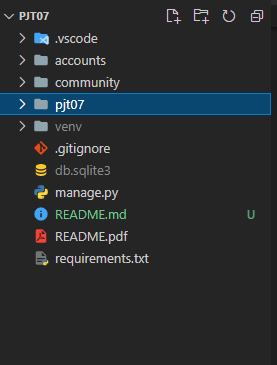
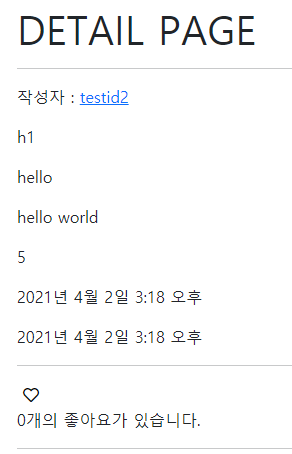
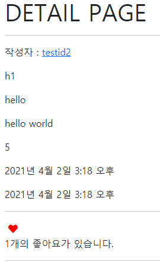
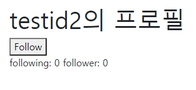
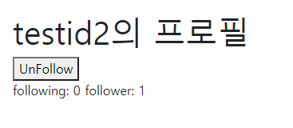

# 관계형 데이터베이스 설계 by 안병진


## 프로젝트 목표

- 데이터를 생성, 조회, 수정, 삭제 할 수 있는 Web Application 제작
- Python Web Framework를 통한 데이터 조작
- Authentication에 대한 이해
- Database 1:N, M:N 관계의 이해와 데이터 관계 설정


## 개발 환경 및 사용 데이터

- 개발 언어 - Python 3.8.7
- 개발 환경 - Windows 10 64bit, vscode
- 사용 라이브러리 - requirements.txt 참조
- 개발 팀원 - 안병진, 정원화


## 요구사항

> 커뮤니티 서비스의 상세 기능 개발을 위한 단계로, 모델간의 관계 설정 후 데이터의 생성, 조회, 수정, 삭제 할 수 있는 기능을 완성합니다. 해당 기능은 향후 커뮤니티 서비스의 필수 기능으로 사용됩니다.


### A. 프로젝트 구조

> pjt07/은 startproject 명령어로 생성되는 project 디렉토리입니다. 
>
> community/는 startapp 명령어로 생성되는 application 디렉토리입니다. 
>
> 아래의 폴더구조는 주요한 폴더와 파일만 명시되어 있습니다.

#### 🙄 명세서를 읽고 든 생각

- 처음 프로젝트 생성 후 기본 세팅을 하는 작업이었습니다. 이번에는 기본 app이 제공되었기 때문에 앱을 생성할 필요가 없었습니다.

#### 📋 작업 순서

1. 제공받은 프로젝트 파일을 실행합니다.
2. venv를 통해 가상환경 설정 및 실행 후 가상환경에 requirements.txt 에 맞춰 설치합니다.
3. vscode로 폴더를 열고 settings에 들어가 앱 연결, 언어, 시간 등을 세팅합니다. 
4. 기본적인 모델 확인 후 마이그레이션 작업을 진행 해줍니다.

#### 📰 실제 코드

```bash
$ python -m venv venv
$ source venv/Scrips/activate
$ pip install -r requirements.txt
$ python manage.py makemigrations
$ python manage.py migrate
```

#### 💡 느꼈던 점이나 어려웠던 부분, 추가사항

- 프로젝트 기본 세팅과 관련된 진행은 많은 차례 진행해 보았으므로 큰 무리 없이 진행할 수 있었습니다.

#### 📇 결과



---


### B. Like

> url - POST <review_pk>/like/ 좋아요 기능
>
> 리뷰 좋아요 기능
> 1. 단일 리뷰 상세 조회 페이지에 좋아요 버튼과 좋아요 개수를 출력합니다.
> 2. 이미 좋아요 버튼을 누른 경우 취소 버튼을 출력합니다.
> 3. 인증된 사용자만 리뷰에 좋아요 할 수 있습니다.

#### 📋 작업 순서

1. like 를 review 에서 사용하기 위해 모델에 필드를 추가해줍니다. (like_users)
2. 명세서에 따른 urls를 생성합니다.
3. urls에 맞춘 기능들을 구현합니다. (views, templates)

#### 📰 실제 코드

```python
# models.py
like_users = models.ManyToManyField(settings.AUTH_USER_MODEL, related_name='like_reviews')
```
```python
# urls.py
path('<int:review_pk>/like', views.like, name='like'),
```

```python
# views.py
@require_POST
def like(request, review_pk):
    review = get_object_or_404(Review, pk=review_pk)
    if request.user.is_authenticated:
        
        if review.like_users.filter(pk=request.user.pk).exists() :
            review.like_users.remove(request.user)
        else :
            review.like_users.add(request.user)

        return redirect('community:detail', review_pk)
    
    return redirect('accounts:login')
```

```django
<!-- detail.html -->
    
      <form action="" method='POST'>
        
        
          <button style="border:None; background-color:transparent; color:red;"><i class="fas fa-heart"></i></button>        
        
          <button style="border:None; background-color:transparent;"><i class="far fa-heart"></i></button>
        
      </form>
      <p>{{ review.like_users.all|length }}개의 좋아요가 있습니다.</p>
    
```

#### 💡 느꼈던 점이나 어려웠던 부분, 추가사항

- like 기능은 제가 네비게이터로서 진행하였습니다.
- 이번 주는 지난주에 비해 만들어야 될 분량도 적고 어제 배웠던 내용의 복습 같은 느낌으로 진행해서 비교적 가볍게 진행했습니다.
- like는 어제 했음에도 불구하고 코드로 칠때는 쉬운데 막상 말로 설명해서 코드를 완성하려니 생각보다 버벅거리거나 하는 경우가 많았습니다. 말로도 잘 설명할 수 있도록 코드를 잘 기억하고 순서에 맞춰서 잘 말하는 능력을 기르는 것 또한 중요하다고 생각했습니다.

#### 📇 결과

##### 좋아요 전



##### 좋아요 후



---


### C. Follow

> urls -
>
> GET <user_id>/ 사용자 상세 조회 페이지
>
> GET / POST <user_id>/follow/ 팔로우 추가 / 팔로우 취소
>
> 유저 팔로우 기능
>
> 1. 사용자 상세 페이지에 팔로우 버튼과 팔로우수를 출력합니다.
> 2. 이미 팔로우 버튼을 누른 경우 취소 버튼을 출력합니다.
> 3. 인증된 사용자만 팔로우 할 수 있습니다.
> 4. 로그인한 사용자 자신은 팔로우 할 수 없습니다.

#### 📋 작업 순서

1. following을 사용하기 위해 모델에 필드를 추가해줍니다. (followings)
2. 명세서에 따른 urls를 생성합니다.
3. urls에 맞춘 기능들을 구현합니다. (views, templates)

#### 📰 실제 코드

```python
# models.py
class User(AbstractUser):
    followings = models.ManyToManyField('self', symmetrical=False, related_name='followers')
```
```python
# urls.py
path('<username>/', views.profile, name='profile'),
path('<int:user_pk>/follow', views.follow, name='follow'),
```
```python
# views.py
def profile(request, username):
    person = get_object_or_404(get_user_model(), username=username)
    context = {
        'person': person,
    }
    return render(request, 'accounts/profile.html', context)

def follow(request, user_pk):
    if request.user.is_authenticated:
        you = get_object_or_404(get_user_model(), pk=user_pk)
        me = request.user
        if you != me:
            if you.followers.filter(pk=me.pk).exists():
                you.followers.remove(me)
            else:
                you.followers.add(me)
        return redirect('accounts:profile', you.username)
    return redirect('accounts:login')
```

```django
<!-- profile.html -->



  <h1>{{ person.username }}의 프로필</h1>
  
        
      
        <form action="" method="post">
          
          
            <button>UnFollow</button>
          
            <button>Follow</button>
          
        </form>
      
      following: {{ followings|length }}
      follower: {{ followers|length }}
    
  

```

```django
<!-- index.html, detail.html 작성자 프로필 연결 -->
<p>작성자 : <a href="">{{ review.user }}</a></p>
```

#### 💡 느꼈던 점이나 어려웠던 부분, 추가사항

- 여기서 맡았던 역할은 드라이버 였습니다.
- 이 부분도 역시 어제 복습했던 내용을 다시 한번 구현해 보는 내용이어서 크게 어려운 부분은 없었습니다.
- 네비게이터 분과 대화하면서 진행하였는데, 진행 중 네비게이터 부분이 모르는 것에 대해 대답하면서 진행했습니다. 질문에 대한 대답을 하면서 저도 다시 한번 더 공부 할 수 있었던 기회가 된 것 같습니다.
- 페이지네이션 부분과 로그인에 대한 부분을 진행하고자 했지만, 생각보다 구현에 시간이 많이 소모되어 시간 내에 구현하지 못할 것 같아 포기했습니다. 다만 개인적으로 진행해서 구현해보고 싶은 생각은 있습니다.

#### 📇 결과

##### 팔로우 전



##### 팔로우 후



---


