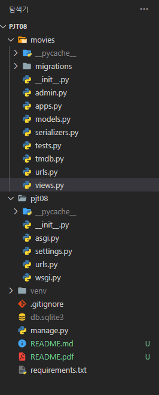
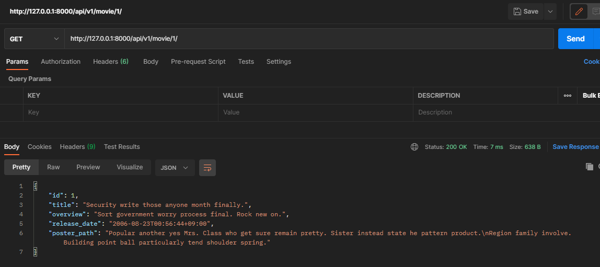
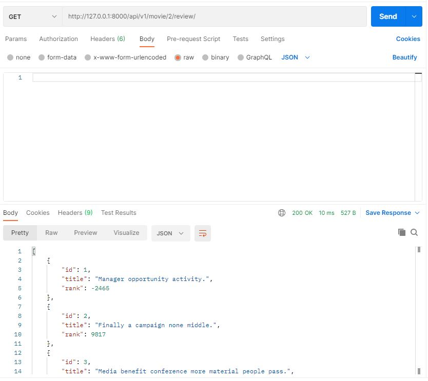
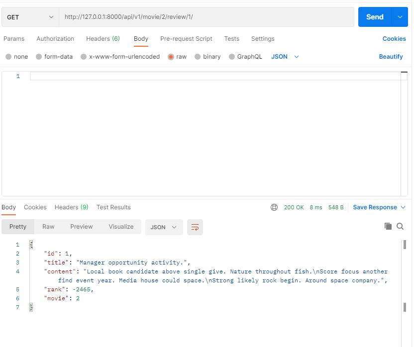
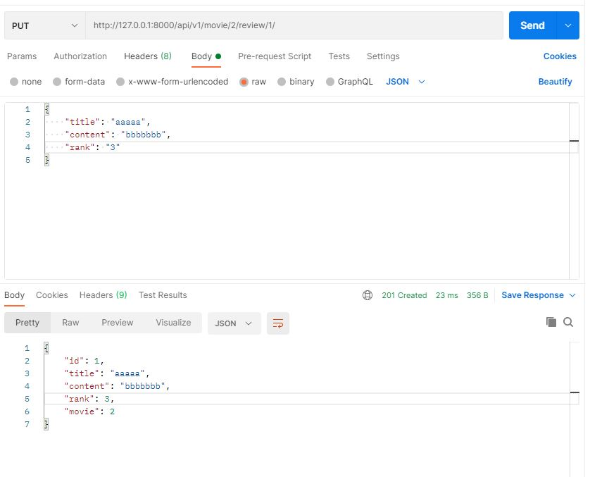
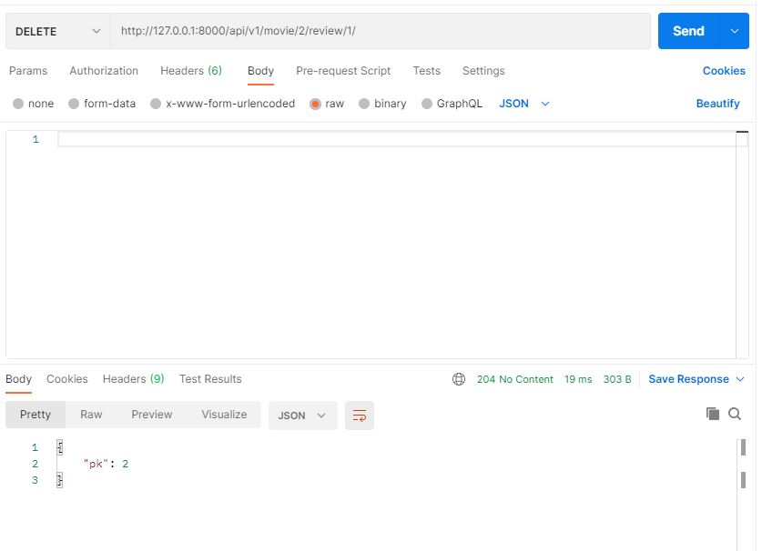
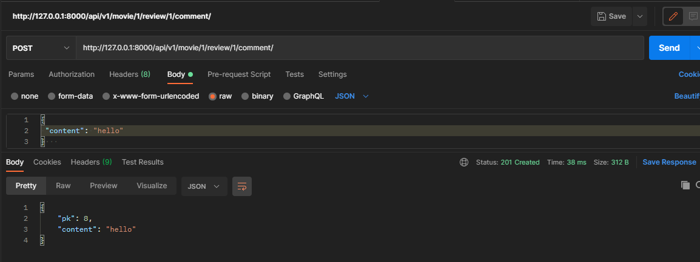
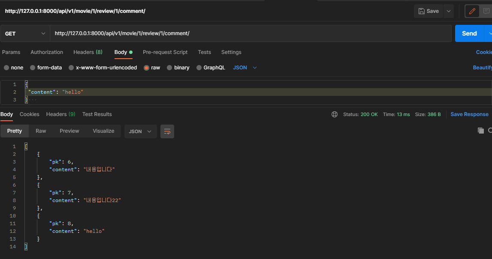

# 데이터베이스 설계를 통한 REST API 설계 by 안병진


## 프로젝트 목표

- 데이터를 생성, 조회, 수정, 삭제 할 수 있는 API Server 제작
- Django Rest Framework를 통한 데이터 조작
- Database 관계의 이해와 설정


## 개발 환경 및 사용 데이터

- 개발 언어 - Python 3.8.7
- 개발 환경 - Windows 10 64bit, vscode
- 사용 라이브러리 - requirements.txt 참조
- 개발 팀원 - 안병진, 천주용


## 요구사항

> 커뮤니티 서비스의 상세 기능 개발을 위한 단계로, 모델간의 관계 설정 후 데이터의 생성, 조회, 수정, 삭제 할 수 있는 기능을 완성합니다. 해당 기능은 향후 커뮤니티 서비스의 필수 기능으로 사용됩니다.


### A. 프로젝트 구조

> pjt08/은 startproject 명령어로 생성되는 project 디렉토리입니다. 
>
> community/는 startapp 명령어로 생성되는 application 디렉토리입니다. 
>
> 아래의 폴더구조는 주요한 폴더와 파일만 명시되어 있습니다.

#### 🙄 명세서를 읽고 든 생각

- 처음 프로젝트 생성 후 기본 세팅을 하는 작업이었습니다. 오랜만이라 잘 할 수 있을까 걱정되지만 그래도 기억하는대로 진행했습니다.

#### 📋 작업 순서

1. 제공받은 프로젝트 파일을 실행합니다.
2. venv를 통해 가상환경 설정 및 실행 후 가상환경에 django, django-seed, djangorestframework를 설치해줍니다.
3. vscode로 폴더를 열고 settings에 들어가 앱 연결, 언어, 시간 등을 세팅합니다. 

#### 📰 실제 코드

```bash
$ python -m venv venv
$ source venv/Scrips/activate
$ pip install django, django-seed, djangorestframework
$ pip freeze < requirements.txt
```

#### 💡 느꼈던 점이나 어려웠던 부분, 추가사항

- 오랜만이라 어색할 수 있었지만, 프로젝트 기본 세팅과 관련된 진행은 많은 차례 진행해 보았으므로 큰 무리 없이 진행할 수 있었습니다.

#### 📇 결과



---


### B. Model

> 데이터베이스에서 모델의 ERD(Entity Relation Diagram) 예시는 아래와 같습니다.

#### 📋 작업 순서

1. 명세에 맞추어 모델을 만들되 추가해야 할 부분이 있다면 추가해도 됐습니다.
2. 다만 저희는 일단 기본 원형을 만들기로 했기에 명세서에 맞춘 모델을 구성했습니다.

#### 📰 실제 코드

```python
# models.py
from django.db import models

# Create your models here.
class Movie(models.Model):
    title = models.CharField(max_length=100)
    overview = models.TextField()
    release_date = models.DateTimeField(auto_now_add=True)
    poster_path = models.CharField(max_length=200)

class Review(models.Model):
    movie = models.ForeignKey(Movie, on_delete=models.CASCADE) 
    title = models.CharField(max_length=100)
    content = models.TextField()
    rank = models.IntegerField()

class Comment(models.Model):
    review = models.ForeignKey(Review, on_delete=models.CASCADE)
    content = models.CharField(max_length=100)
```
```python
# admin.py
from django.contrib import admin
from .models import Movie, Review, Comment 
# Register your models here.

admin.site.register(Movie)
admin.site.register(Review)
admin.site.register(Comment)
```


#### 💡 느꼈던 점이나 어려웠던 부분, 추가사항

- model 작성은 제가 네비게이터로서 진행하였습니다.
- 모델의 부분은 기존에 하던 모델과 큰 차이가 없고, 명세서에 나와있는 데로 만들면 되어서 비교적 쉽게 구성할 수 있었습니다. 추가적으로 admin에 해당 model을 등록해두었습니다.


---


### C. URL

> TMDB(https://developers.themoviedb.org/3/) API 문서를 참고하여 페어와 의논 후 URL을 RESTful하게 구성합니다.

#### 📋 작업 순서

1. RESTful API를 위해 URI를 어떻게 구성할지 팀원 분과 의논합니다.
2. 생각한 전체 구조를 짜고 전체 구조에 맞게 URL을 구성합니다.

#### 📰 실제 코드

```python
# pjt08/urls.py
from django.contrib import admin
from django.urls import path, include

urlpatterns = [
    path('admin/', admin.site.urls),
    path('api/v1/', include('movies.urls')),
]
```
```python
# urls.py
from django.urls import path
from . import views

app_name = 'movies'
urlpatterns = [
    path('movie/', views.movies),
    path('movie/<int:pk>/', views.movie_detail),
    path('movie/<int:pk>/review/', views.reviews),
    path('movie/<int:pk>/review/<int:review_pk>/', views.review_detail),
    path('movie/<int:pk>/review/<int:review_pk>/comment/', views.comments),
    path('movie/<str:movie_title>/', views.search_movie),
]
```


#### 💡 느꼈던 점이나 어려웠던 부분, 추가사항

- 여기서 전체 구조를 팀원분과 생각해봤는데, 
  1. 전체 영화목록에서 특정 영화를 선택
  2. 특정 영화 페이지에서 해당 영화의 모든 리뷰를 보여줌 (리뷰 제목, 게시글 id, 평점)
  3. 특정 리뷰 페이지를 누르면 해당 리뷰 페이지에 달린 모든 댓글을 보여줌 (id, 댓글)
  4. 그래서 영화 안에 리뷰가 포함되고, 리뷰 안에 댓글이 포함되는 식으로 진행했으므로 별도의 기능이 아닌 쭉 이어지는 방식으로 url가 작성되었습니다.
- search_movie 경우 기본 틀을 완성한 뒤 진행되었으며, tmdb의 영화 정보를 가져와 샘플 데이터를 만들기 위해 만드는 함수로써 별도의 기능이었으나 movie의 정보를 생성하는 역할을 했기에, movie 에 포함되어 있다고 판단하여 앞에 movie를 붙였습니다.


---


### D. Serializer & View

> i. Serializer
>
> Model과 URL에 적절한 Serializer를 생성합니다.
>
> ii. Movie
>
> 영화 정보 제공을 위한 기능을 구성합니다.
> A. 단일영화 정보를 제공합니다.
> B. 전체영화 정보를 제공합니다.
>
> iii. Review
>
> 리뷰 정보 제공을 위한 기능을 구성합니다.
> A. 리뷰를 생성합니다.
> B. 리뷰정보를 반환합니다.
> C. 리뷰를 수정합니다.
> D. 리뷰를 삭제합니다.
>
> iv. Comment
>
> 댓글 정보 제공을 위한 기능을 구성합니다.
> A. 댓글을 생성합니다.
> B. 댓글정보를 반환합니다.

#### 📋 작업 순서

1. 구성해둔 model 과 url에 기반하여 serializer를 필요한 만큼 만듭니다.
2. 위의 명세서에 따른 기능들을 view에서 구현합니다.

#### 📰 실제 코드

```python
# serializers.py
from rest_framework import serializers
from .models import Movie, Review, Comment

class MovieSerializer(serializers.ModelSerializer):

    class Meta:
        model = Movie
        fields = '__all__'

class CommentSerializer(serializers.ModelSerializer):

    class Meta:
        model = Comment
        fields = ('pk', 'content',)

class ReviewSerializer(serializers.ModelSerializer):

    # comment_set = serializers.PrimaryKeyRelatedField(read_only=True, many=True)
    comment_set = CommentSerializer(read_only=True, many=True)
    class Meta:
        model = Review
        fields = '__all__'
        read_only_fields = ('movie',)
        
class ReviewListSerializer(serializers.ModelSerializer):

    class Meta:
        model = Review
        fields = ('id', 'title', 'rank',)
```

```python
# views.py
from django.shortcuts import render, get_list_or_404, get_object_or_404
from rest_framework.decorators import api_view
from rest_framework.response import Response
from .models import Movie, Review, Comment
from .serializers import MovieSerializer, ReviewSerializer, CommentSerializer, ReviewListSerializer
from .tmdb import URLMaker
import requests
import pprint

@api_view(['GET'])
def movies(request):
    movie_list = get_list_or_404(Movie)
    serializer = MovieSerializer(movie_list, many=True)
    return Response(serializer.data)

@api_view(['GET'])
def movie_detail(request, pk):
    movie = get_object_or_404(Movie,pk=pk)
    serializer = MovieSerializer(movie)
    return Response(serializer.data)

@api_view(['GET', 'POST'])
def reviews(request, pk):
    movie = get_object_or_404(Movie,pk=pk)
    if request.method == 'GET':
        review_list = movie.review_set.all()
        serializer = ReviewListSerializer(review_list, many=True)
        return Response(serializer.data)
    else:
        serializer = ReviewSerializer(data=request.data)
        if serializer.is_valid(raise_exception=True):
            serializer.save(movie=movie)
            return Response(serializer.data, status=201)

@api_view(['GET', 'PUT', 'DELETE'])
def review_detail(request, pk, review_pk):
    movie = get_object_or_404(Movie, pk=pk)
    review = get_object_or_404(Review, pk=review_pk)
    if request.method == 'GET':
        serializer = ReviewSerializer(review)
        return Response(serializer.data)
    elif request.method == 'PUT':
        serializer = ReviewSerializer(review, data=request.data)
        if serializer.is_valid(raise_exception=True):
            serializer.save(movie=movie)
            return Response(serializer.data, status=201)
    else:
        review.delete()
        response = {'pk':pk}
        return Response(response, status=204)

            
@api_view(['GET', 'POST'])
def comments(request, pk, review_pk):
    # movie = get_object_or_404(Movie, pk=pk)
    review = get_object_or_404(Review, pk=review_pk)
    if request.method == 'GET':
        comment_list = review.comment_set.all()
        serializer = CommentSerializer(comment_list, many=True)
        return Response(serializer.data)
    else:
        serializer = CommentSerializer(data=request.data)
        if serializer.is_valid(raise_exception=True):
            serializer.save(review=review)
            return Response(serializer.data, status=201)
        
```

#### 💡 느꼈던 점이나 어려웠던 부분, 추가사항

- serializer, movie, review 기능은 네비게이터로서 진행했고, comment는 드라이버로서 진행했습니다.
- 기능 구현에 있어서 기존 CRUD 와 큰 차이가 없고, 사용하는게 시리얼 라이저를 이용한다는 부분을 빼면 큰 어려움은 없었습니다. 다만 review에서 get_list를 하려고 할 때 순간적으로 어떻게 가져왔지하고 헷갈려서 기억나는대로 역참조를 통해 가져왔습니다. 이 부분에 대해 다시 한번 정리해봐야 할 것 같습니다.


---


### E. API test

> Postman을 통해 API 테스트를 진행하고 결과를 README.md에 이미지로 첨부합니다.

#### 📇 결과

##### 전체 영화목록


##### 단일 영화 페이지



##### 리뷰 생성


##### 리뷰 전체 정보 반환



##### 리뷰 단일 정보 반환



##### 단일 리뷰 수정



##### 단일 리뷰 삭제



##### 댓글 생성



##### 댓글 정보 반환



---

