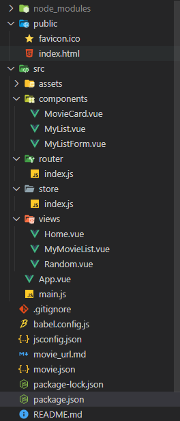
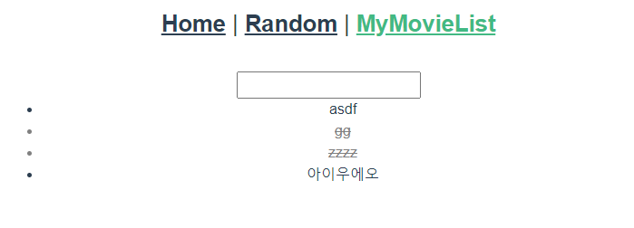

# Vue를 활용한 SPA 구성 by 안병진


## 프로젝트 목표

- 영화 정보를 제공하는 SPA 제작
- AJAX통신과 JSON 구조에 대한 이해
- Single File Component 구조에 대한 이해
- vue-cli, vuex, vue-router등 플러그인 활용


## 개발 환경 및 사용 데이터

- 개발 언어 - Node 14.16.1, Vue.js 2.6.11
- 개발 환경 - Windows 10 64bit, vscode
- 사용 라이브러리 - package.json 참고
- 사용 데이터 - movie.json (외부에서 받아옴)
- 팀원 - 안병진, 엄재식


## 요구사항


### A. 컴포넌트 구조

> 전체 컴포넌트 구조를 구성합니다.

#### 📋 작업 순서

1. 개발 버전 확인을 합니다.
2. 먼저 프로젝트를 생성합니다.
3. 필요한 라이브러리를 설치합니다. (lodash, vuex, vue-router)
4. 기본적인 컴포넌트 vue를 생성합니다. (구조에 맞추어)
5. 전역으로 bootstrap을 사용하기 위해 index.html에 cdn을 넣어줍니다.

#### 📰 실제 코드

```bash
$ node -v
$ vue -V
$ vue create pjt10
$ npm install lodash
$ vue add vuex
$ vue add router
```

```html
<!-- index.html -->
<link href="https://cdn.jsdelivr.net/npm/bootstrap@5.0.1/dist/css/bootstrap.min.css" rel="stylesheet"
      integrity="sha384-+0n0xVW2eSR5OomGNYDnhzAbDsOXxcvSN1TPprVMTNDbiYZCxYbOOl7+AMvyTG2x" crossorigin="anonymous">
    <script src="https://cdn.jsdelivr.net/npm/bootstrap@5.0.1/dist/js/bootstrap.bundle.min.js"
      integrity="sha384-gtEjrD/SeCtmISkJkNUaaKMoLD0//ElJ19smozuHV6z3Iehds+3Ulb9Bn9Plx0x4" crossorigin="anonymous"></script>
```

#### 💡 느꼈던 점이나 어려웠던 부분, 추가사항

- 기본적인 세팅은 크게 어렵진 않았지만 vuex와 router로 불러오는게 맞나 잠깐 헷갈렸습니다.

#### 📇 결과



---


### B. router

| path         | component   | 설명                    |
| ------------ | ----------- | ----------------------- |
| /            | Home        | 전체 영화 목록 페이지   |
| /random      | Random      | 랜덤 영화 추천 페이지   |
| /mymovielist | MyMovieList | 개인 영화 리스트 페이지 |

#### 📋 작업 순서

1. add router가 된 기본 상태에서 3개의 vue를 views 폴더에 생성합니다.
2. App.vue에 template 부분에 3개의 url router-link를 만들어 줍니다.
3. router/index.js에 해당하는 url을 연결 해줍니다.

#### 📰 실제 코드

```vue
<template>
  <div id="app" class="container" >
    <div id="nav">
      <h3>
        <router-link to="/">Home</router-link> |
        <router-link to="/random">Random</router-link> |
        <router-link to="/mymovielist">MyMovieList</router-link>
      </h3>
    </div>
    <router-view/>
  </div>
</template>
```

```js
// router/index.js
import Vue from 'vue'
import VueRouter from 'vue-router'
import Home from '../views/Home.vue'
import Random from '@/views/Random'
import MyMovieList from '@/views/MyMovieList'

Vue.use(VueRouter)

const routes = [
  {
    path: '/',
    name: 'Home',
    component: Home
  },
  {
    path: '/random',
    name: 'Random',
    component: Random
  },
  {
    path: '/mymovielist',
    name: 'MyMovieList',
    component: MyMovieList
  }
]

const router = new VueRouter({
  mode: 'history',
  base: process.env.BASE_URL,
  routes
})

export default router

```

#### 💡 느꼈던 점이나 어려웠던 부분, 추가사항

- router에 등록하는 부분은 연결하는 방법이 home.vue를 통해 예시로 보여져 있었으므로 나머지 2개도 home.vue를 따라 만들어서 쉽게 만들 수 있었습니다.
- router 사용시 app.vue는 단순히 url 연결의 역할만 하는 것을 다시 한번 복습 할 수 있었습니다. (기본적으로 app.vue는 최상단에서 모든 컴포넌트를 직접 썼는데 이번에는 url 별로 넘겨주는 방식으로 컴포넌트를 연결함)

#### 📇 결과


---


### C. views에 들어가기전 vuex 정의 

> 실제로는 views를 만들면서 필요한 순간에 정의되었지만 vuex가 정의된 전체 부분을 정리해서 보여주는게 낫다고 생각해서 따로 나눠서 설명합니다.

#### 📋 작업 순서

1. views에서 기능을 만들 때 공유될 데이터가 있다고 판단하면 vuex에서 정의 및 데이터 구축 방법을 정의합니다.
2. vuex에서 정의된 방법에 따라 추후에 필요한 컴포넌트에서 적절히 꺼내 사용합니다.

#### 📰 실제 코드

```js
import Vue from 'vue'
import Vuex from 'vuex'
import axios from 'axios'
import _ from 'lodash'

Vue.use(Vuex)

export default new Vuex.Store({
  state: {
    movies: [],
    wishes: [],
  },
  mutations: {
    ADD_MOVIE: function (state, movieList) {
      state.movies = movieList
    },
    ADD_WISH: function (state, wish) {
      state.wishes.push(wish)
    },
    UPDATE_WISH: function (state, changedWish) {
      state.wishes = state.wishes.map(wish => {
        if (wish.id === changedWish.id) {
          return changedWish
        }
        return wish
      })
    },
  },
  actions: {
    getMovies: function (context) {
      axios.get('https://gist.githubusercontent.com/eduChange-hphk/d9acb9fcfaa6ece53c9e8bcddd64131b/raw/9c8bc58a99e2ea77d42abd41376e5e1becabea69/movies.json')
        .then((response) => {
          context.commit('ADD_MOVIE', response.data)
          console.log(response.data)
      })
    },
    addMovie: function (context, content) {
      const wish = {
        id: _.uniqueId(),
        content: content,
        completed: false,
      }
      context.commit('ADD_WISH', wish)
    },
    updateWish: function (context, wish) {
      context.commit('UPDATE_WISH', { ...wish, completed: !wish.completed })
    }     
  },
})
```

#### 💡 느꼈던 점이나 어려웠던 부분, 추가사항

- 라이브로도 1~2번 보고 실습으로도 직접 해봤음에도, 막상 구현하려니 꽤 어렵게 느껴졌던 부분 중 하나입니다. 실습 때 구현했던 기억을 더듬어가며 구현을 진행하였는데, 생각보다 까다로웠습니다.
- 특히 처음에 getMovies를 만들 때, axios사용이 오랜만인지라 작성이 꽤 헷갈려서 어려움을 겪었습니다. axios를 개인적으로 연습해봐야 할 것 같습니다.
- updateWish를 할 때도, {}를 통해 ...wish와 completed를 역으로 뒤집어서 보내는 것이 생각보다 기억이 잘 나지않아 애먹었습니다. 좀 더 공부가 필요한 부분 같습니다.
- movies와 ADD_MOVIE, getMovies는 Home.vue에서 사용되었고 wishes와 ADD_WISH, UPDATE_WISH, addMovie, updateWish는 MyMovieList.vue에서 사용되었습니다.


---


### D.  Views - Random.vue & Home.vue

> Random.vue
>
> 1. Pick 버튼을 클릭하면 랜덤으로 영화 제목 하나를 출력합니다.
> 2. 영화 제목 데이터는 Random.vue 내부의 data 속성에 임의의 배열을 만들어 사용합니다. (데이터의 내용은 무관합니다.)
>
> Home.vue
>
> 1. 영화 전체 데이터를 출력합니다.
> 2. AJAX 통신을 이용하여 JSON데이터를 받아와 영화 포스터, 제목, 줄거리 데이터를 출력합니다.
> 3. 영화 포스터, 제목, 줄거리 데이터를 출력합니다.
> 4. 받아온 JSON데이터는 Home.vue 내부의 data 속성에 저장 후MovieCard.vue 컴포넌트를 이용하여 출력합니다.

#### 📋 작업 순서

1. 먼저 Home.vue를 구성했습니다. Home.vue에서 mounted를 통해 첫 화면에 로드되면서 json 파일을 가져오도록 하였습니다.
2. json파일을 가져와 vuex에 저장한 뒤, 해당 movies 배열을 기반으로 v-for문을 돌려 각 movie를 MovieCard.vue에 넘겨주어 부트스트랩 카드형태로 출력하도록 했습니다.
3. 전체적인 틀을 구성하기 위해 grid를 이용, 특정 비율로 나눠서 한 줄에 특정 카드 갯수를 출력하도록 하였습니다.
4. 다음으로 Random.vue의 경우 json파일로 가져와 vuex에 저장된 movies 배열을 기준으로 lodash의 sample을 사용, 거기서 title(제목) 부분만 가져와서 출력하도록 하였습니다. 

#### 📰 실제 코드

```vue
<!-- Home.vue -->
<template>
  <div class="home d-flex justify-content-center row row-cols-1 row-cols-md-2 g-4">
    <MovieCard v-for="movie in movies" :key="movie.title" :movie="movie" />
  </div>
</template>

<script>
// @ is an alias to /src
import MovieCard from '@/components/MovieCard.vue'
import { mapState } from 'vuex'


export default {
  name: 'Home',
  components: {
    MovieCard
  },
  mounted: function () {
    this.$nextTick(function () {
      this.$store.dispatch('getMovies')
    })
  },
  computed: {
    ...mapState(['movies'])
  }
}
</script>

```

```vue
<!-- MovieCard.vue -->
<template>
  <div class="col card p-1 m-2" style="width: 18rem;">
    
    <div class="card-body">
      <h5 class="card-title">{{ movie.title }}</h5>
      <p class="card-text">{{ movie.overview }}</p>
    </div>
  </div>
</template>

<script>
export default {
  name: 'MovieCard',
  props: {
    movie: {
      type: Object,
      required: true,
    },
  },
  data: function () {
    return {
      poster: "https://image.tmdb.org/t/p/original/"+String(this.movie.poster_path),
    }
  }
}
</script>
```

```vue
<!-- Random.vue -->
<template>
  <div class="random">
    <h1>오늘의 영화</h1>
    <button @click="onClick">랜덤 뽑기</button>
    <hr>
    <h2>
      <p v-text="titleText"></p>
    </h2>
  </div>
</template>

<script>
import _ from 'lodash'
import { mapState } from 'vuex'

export default {
  name: 'Random',
  data: function () {
    return {
      titleText: '',
    }
  },
  computed: {
    ...mapState(['movies'])
  },
  methods: {
    onClick: function () {
      this.titleText = _.sample(this.$store.state.movies).title
    }
  }
}
</script>
```

#### 💡 느꼈던 점이나 어려웠던 부분, 추가사항

- 처음 외부에 있는 데이터를 로드시에 바로 불러올 수 있게 하는 방법에 대해서 어떻게 해야될지 막막했는데, 잘 생각해보니 mounted와 같이 라이프사이클을 이용하면 되지 않을까는 생각을 했고, 예상대로 잘 로드 된 것 같아 만족스러웠습니다.
- 외부에서 movie.json 파일을 가져왔을 때, 처음에 v-for를 돌리기 위해 vuex에 movies를 만들어 놓고 꺼내오려고 했는데, movies에 push를 통해 데이터를 집어넣다보니 movies안에 데이터 전체가 하나의 인덱스로 들어가버려서 v-for문이 제대로 작동하지 않았습니다.
  - 해당 부분을 꽤 오래 찾지못해서 시간을 잡아먹었는데, 이러한 미스를 줄일 수 있도록 코드를 꼼꼼히 보는 습관을 길러야 할 것 같습니다.
- poster_path를 이용해 이미지 링크를 만들려고했는데, json에서는 기본 http url이 없고 뒤의 부분만 적혀있어서 별도로 변수에 문자열을 만들어서 집어넣으려고 했는데, poster_path 부분이 문자열이라서 단순 문자열+문자열로 합치면 만들어 질거라고 생각했는데 undefined로 출력 결과가 나와서 당황했습니다.
  - 결국엔 파이썬처럼 이미지 주소+String(poster_path)을 통해 완성을 해서 이미지 데이터를 가져올 수 있었습니다.
- random을 구현할 때 제대로 기억나지 않아 찾아본 결과 sample 함수를 이용한 다는 것을 알게 되고 사용했습니다. 처음에는 mapState에서 movies를 가져오면 사용 가능할 줄알고 sample 안에 넣었는데 작동이 제대로 되질 않아 일단 직접 store에서 가져오는 방법으로 집어넣었습니다.
- p태그와 같이 양방향 데이터가 안되고, 단지 텍스트 출력을 위함이면 v-text로 사용해야 한다는 것을 이번에 배웠습니다. v-bind를 사용하면 vue 콘솔에서 경고 메세지가 떴는데, 객체형태나 배열 형태로 넘겨주라고 써있었습니다. v-model의 경우 양방향 데이터 통신이 안되므로 아예 사용이 불가능하였습니다. v 기능에 대해 좀 더 꼼꼼히 알아둬야 할 것 같습니다.

#### 📇 결과

- Home 화면


- Random 화면


---


### E. Views - MyMovieList.vue

> 1. 보고싶은 영화를 저장할 수 있는 페이지를 구현합니다.
> 2. input 태그에 영화 제목을 입력 후 enter키 혹은 add 버튼을 클릭했을 때 입력한 데이터를 저장합니다.
> 3. MyListForm.vue는 데이터를 입력하는 기능을 가진 컴포넌트입니다.
> 4. MyList.vue는 저장된 데이터를 출력하는 기능을 가진 컴포넌트입니다.

#### 📋 작업 순서

1. MyMovieList.vue에서는 MyListForm과 MyList를 보여주기 위한 템플릿을 구성합니다. MyList에는 v-for문을 통해 넘겨야하므로 wishes를 가져와 for문을 구성해 넘겨줍니다. 
2. MyListForm.vue에 데이터를 입력하고 엔터를 누르면 해당 데이터를 기반으로 wish 객체를 생성하고, wishes배열에 추가하도록 합니다.
3. MyList는 MyMovieList에서 데이터를 받기위해 props를 정의하고, 해당 데이터를 적절히 템플릿으로 만들어 출력해줍니다. 추가적으로 해당 li를 클릭했을 시 상태를 변화하여 완료, 비완료로 나눌 수 있도록 클래스를 만들어주고, css를 통해 다르게 보일 수 있도록 바꿔줍니다.

#### 📰 실제 코드

```vue
<!-- MyMovieList.vue -->
<template>
  <div>
    <MyListForm />
    <ul>
      <MyList
        v-for="wish in wishes"
        :key="wish.id"
        :wish="wish"
      />
    </ul>
  </div>
</template>

<script>
import MyListForm from '@/components/MyListForm.vue'
import MyList from '@/components/MyList.vue'
import {mapState} from 'vuex'

export default {
  name: 'MyMovieList',
  components: {
    MyListForm,
    MyList,
  },
  computed: {
    ...mapState(['wishes']),
  },
}
</script>
```

```vue
<!-- MyListForm.vue -->
<template>
  <div>
    <input type="text" v-model="content" @keyup.enter="onEnter">
  </div>
</template>

<script>
export default {
  name: 'MyListForm',
  data: function () {
    return {
      content: '',
    }
  },
  methods: {
    onEnter: function () {
      this.$store.dispatch('addMovie', this.content)
      this.content = ''
    }
  }
}
</script>
```

```vue
<!-- MyList.vue -->
<template>
    <li @click="onWishClick" :class="{completed:wish.completed}">
      <span>{{ wish.content }}</span>
    </li>
</template>

<script>
import {mapState} from 'vuex'

export default {
  name: 'MyList',
  computed: {
    ...mapState(['wishes']),
  },
  methods: {
    onWishClick: function () {
      this.$store.dispatch('updateWish', this.wish)
    }
  },
  props: {
    wish: {
      type: Object,
      required: true,
    }
  }
}
</script>
<style>
  .completed{
    text-decoration: line-through;
    color: grey;
  }
</style>
```

#### 💡 느꼈던 점이나 어려웠던 부분, 추가사항

- MyListForm의 경우 add 부분이라서 크게 차이가 어려움은 없었습니다.
- 처음에는 MyList에서 v-for문을 돌려서 li형태로 출력하도록 했는데, 상태를 업데이트하기 위해 특정 wish를 골라낼 방법을 찾지 못해서 home에서 구축한 방법대로 상위 컴포넌트에서 개별적으로 데이터를 보내고 MyList에서는 받아서 사용하도록 바꿨습니다. 
- 업데이트 함수는 vuex에서 구성시 일반 add보다 조금 더 까다로워서 시간이 더 걸렸습니다. 

#### 📇 결과



---


